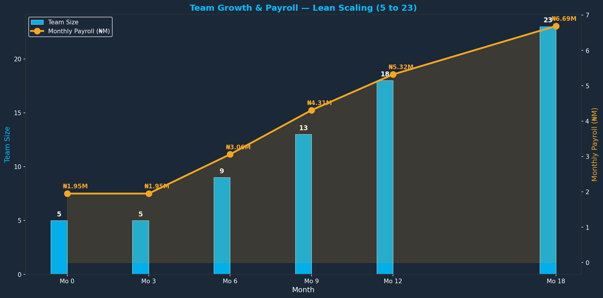
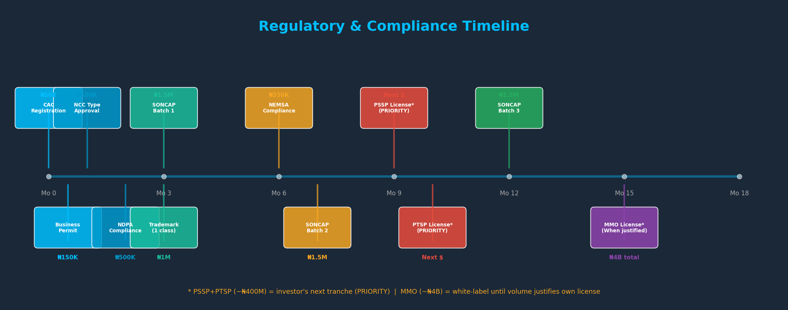
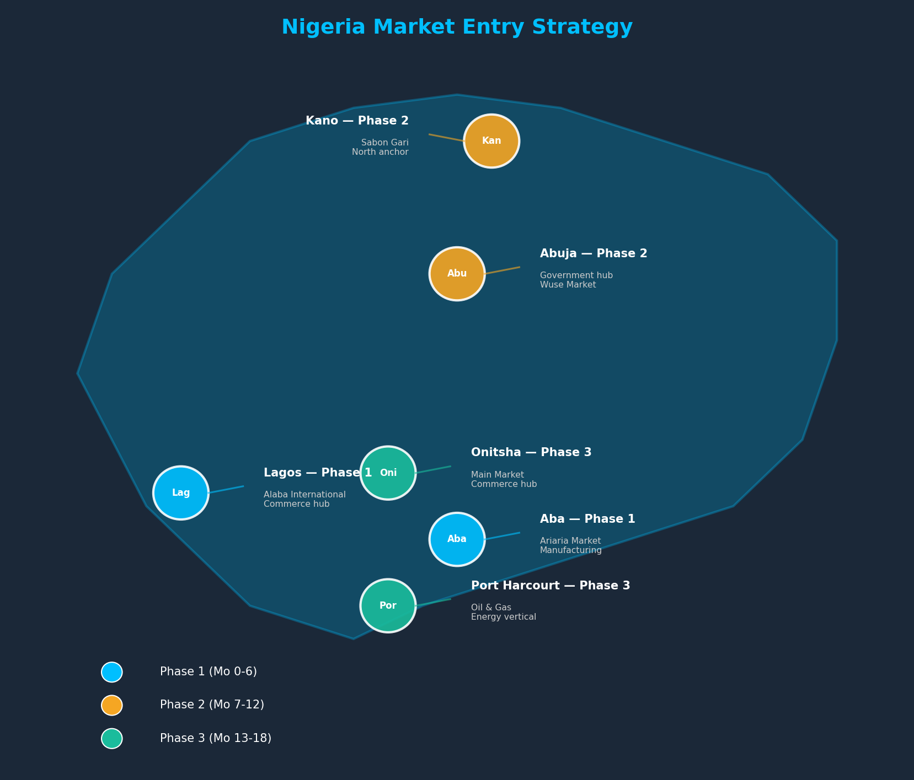
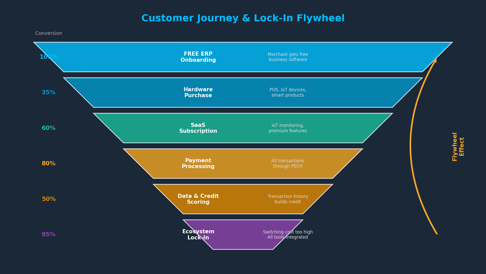
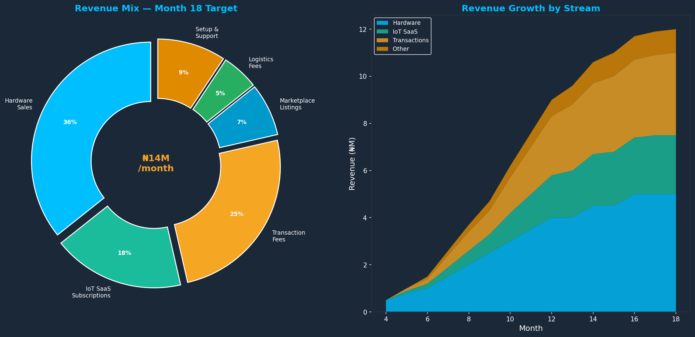
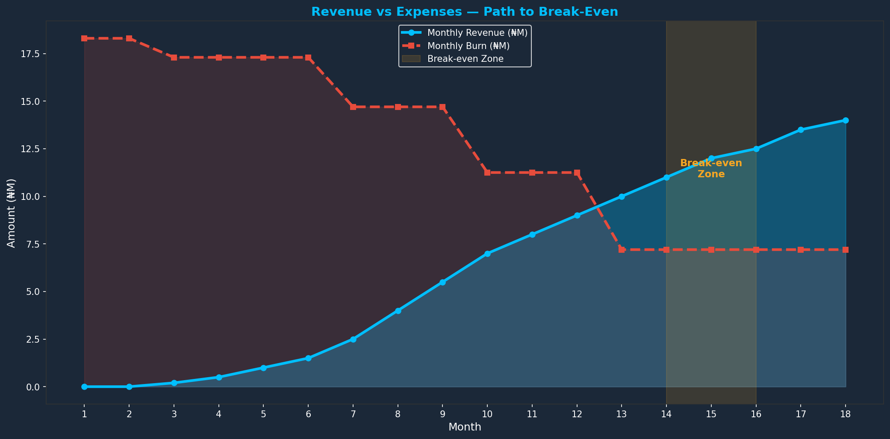
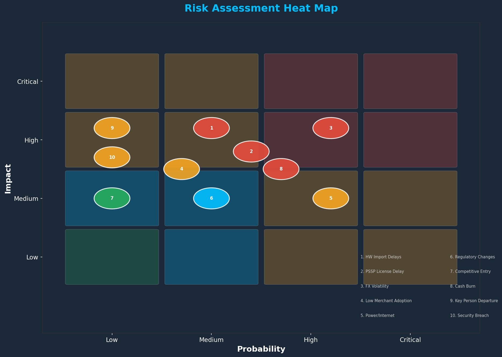
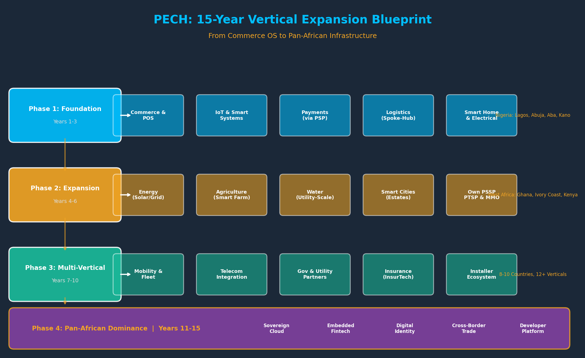

# PECH: Africa's Commerce & Infrastructure Operating System
## ₦250M Capital Deployment Plan — 18-Month Operational Roadmap

---

**Prepared by:** PECH Group Holdings Ltd
**Date:** March 2026
**Capital Requirement:** ₦250,000,000 (Two Hundred and Fifty Million Naira)
**Deployment Period:** 18 Months (March 2026 — August 2027)
**Confidentiality:** This document is strictly confidential

---

## Table of Contents

1. [Executive Summary](#1-executive-summary)
2. [The Opportunity](#2-the-opportunity)
3. [PECH Ecosystem Overview](#3-pech-ecosystem-overview)
4. [Ecosystem Architecture Diagram](#4-ecosystem-architecture-diagram)
5. [Platform Breakdown & Build Strategy](#5-platform-breakdown--build-strategy)
6. [Phased Execution Roadmap (18 Months)](#6-phased-execution-roadmap-18-months)
7. [Capital Deployment Plan](#7-capital-deployment-plan)
8. [Human Capital & Hiring Plan](#8-human-capital--hiring-plan)
9. [Technology & AI Tools Budget](#9-technology--ai-tools-budget)
10. [Hardware & Device Strategy](#10-hardware--device-strategy)
11. [Licensing, Compliance & Regulatory](#11-licensing-compliance--regulatory)
12. [Marketing & Customer Acquisition](#12-marketing--customer-acquisition)
13. [Revenue Model & Financial Projections](#13-revenue-model--financial-projections)
14. [Risk Analysis & Mitigation](#14-risk-analysis--mitigation)
15. [Equity & Governance](#15-equity--governance)
16. [Key Performance Indicators](#16-key-performance-indicators)
17. [Use of Funds Summary](#17-use-of-funds-summary)
18. [Appendix](#18-appendix)

---

## 1. Executive Summary

**PECH Group Holdings Ltd** is building **Africa's first vertically-integrated Commerce & Infrastructure Operating System** — a multi-platform ecosystem combining:

- **Embedded ERP** — Free business management software for African SMEs
- **IoT & Smart Systems Platform** — Hardware + cloud for energy, security, estate management
- **Smart Water Controllers** — Multi-tier water level controllers (Basic → IoT → Industrial/SCADA)
- **Smart Home & Electrical** — Switches, sockets, cameras (smart and non-smart), energy storage
- **Learning Tablets & EdTech** — Hardware for education content deployment with open API for creators
- **Yiwu-Style Marketplace** — Digital twin of Nigeria's physical wholesale markets
- **Spoke-and-Hub Logistics** — Cainiao-inspired parcel management platform
- **Payments Infrastructure** — PSSP/PTSP-licensed payment processing across all platforms
- **Advertising & LED Displays** — Digital signage and advertising infrastructure (Phase 2)
- **Self-Service Kiosks** — Multi-purpose payment and information kiosks

### Our Mission
PECH is a **technology and platform infrastructure enabler for people**. We build the digital backbone that African businesses, homes, and communities run on. Every product we ship — from a ₦1,500 premium socket to a ₦350,000 estate system — represents **reliability, quality, and good price for your money**. We sell high-end products AND equally good affordable products, but **never bad products**. Quality is our brand promise.

### Designed for Africa, Powered by PECH
All PECH products are **designed specifically for African conditions** — wide voltage tolerance (140–280V), heat resistance, dust/water protection, and offline capability. Every product is **progressively integrated across PECH's entire ecosystem**: the IoT platform powers device intelligence, the ERP connects business operations, the Marketplace enables discovery and sales, Logistics handles delivery, and Payments processes transactions. A PECH smart switch is not just a switch — it's a node in Africa's commerce and infrastructure operating system.

This plan details the deployment of **₦250,000,000** in secured capital across the first **18 months** of simultaneous lean platform launches, targeting **Nigeria first** with a clear path to West African expansion. Additional capital will be injected by the investor as the business gains traction.

### Why PECH Will Win

| Competitive Edge | Description |
|-----------------|-------------|
| **Ecosystem Lock-In** | Free ERP creates daily dependency; hardware deepens it |
| **African-Optimized** | Offline-first, power-resilient, multi-network design |
| **Data Moat** | Transaction + energy + logistics data enables credit scoring |
| **Founder Advantage** | Founder directly sources hardware from China (Shenzhen) |
| **No Single-Point Competition** | No African company combines all 6 layers |

### Key Targets (18 Months)

| Metric | Target |
|--------|--------|
| Active Merchants (ERP) | 1,500–3,000 |
| IoT Devices Deployed | 500–1,000 |
| Markets Digitized | 3–5 major markets |
| Monthly Recurring Revenue | ₦8M–₦15M by Month 18 |
| Team Size | 25–35 people |
| Payment Volume (GMV) | ₦500M+ cumulative |

---

## 2. The Opportunity

### Africa's Commerce Infrastructure Gap

| Problem | Scale |
|---------|-------|
| African SMEs without ERP/digital tools | 90%+ |
| Nigerian businesses using informal credit | 80%+ |
| African IoT market (2026) | $4.85 Billion |
| Nigeria food waste from cold chain failure | $2.3–3.3 Billion/year |
| Nigerian merchants on WhatsApp-only sales | 70%+ |
| Markets with zero digital presence | Thousands |

### Why Now

- Smartphone penetration accelerating across Nigeria
- Digital payments adoption (Paystack, Flutterwave, OPay growing rapidly)
- CBN pushing financial inclusion and PSSP licensing
- No dominant African commerce OS exists yet — **first-mover advantage is real**
- Nigeria's Data Protection Act (NDPA) favors local platforms

---

## 3. PECH Ecosystem Overview


PECH is modeled after **Alibaba Group's layered architecture**, adapted for African realities:

| PECH Layer | Alibaba Equivalent | Function |
|------------|-------------------|----------|
| Embedded ERP | Alibaba Merchant Tools / DingTalk | Free business software → creates daily dependency |
| YiwuGou Marketplace | 1688.com / YiwuGou | Digital twin of physical markets → national discovery |
| Payments & Wallets | Alipay / Ant Group | Payment processing → data visibility |
| Logistics Platform | Cainiao Network | Spoke-and-hub parcel management → movement coordination |
| Fintech & Credit | Ant Financial / MYbank | Credit scoring from real data → monetization |
| Data & APIs | Alibaba Cloud / Data Services | Trade intelligence → sold to banks/governments |
| IoT & Smart Systems | Alibaba Cloud IoT | Energy, security, estate management → infrastructure |
| Smart Hardware | Ant POS / Alibaba Devices | POS, meters, controllers → hardware monetization |

---

## 4. Ecosystem Architecture Diagram

```
┌─────────────────────────────────────────────────────────────────────────┐
│                    PECH GROUP HOLDINGS LTD                              │
│              Africa's Commerce & Infrastructure OS                      │
├─────────────────────────────────────────────────────────────────────────┤
│                                                                         │
│  ┌──────────────┐  ┌──────────────┐  ┌──────────────┐  ┌────────────┐  │
│  │   EMBEDDED   │  │  MARKETPLACE │  │  SPOKE & HUB │  │  IoT &     │  │
│  │     ERP      │  │  (YiwuGou)   │  │  LOGISTICS   │  │  SMART     │  │
│  │              │  │              │  │              │  │  SYSTEMS   │  │
│  │ • Inventory  │  │ • Market     │  │ • Spoke App  │  │            │  │
│  │ • Sales      │  │   Digitize   │  │   (52 scrns) │  │ • Energy   │  │
│  │ • Debtors    │  │ • Shop       │  │ • Hub App    │  │ • Security │  │
│  │ • Reporting  │  │   Directory  │  │   (94 scrns) │  │ • Estates  │  │
│  │ • Mobile-1st │  │ • Discovery  │  │ • Sorting    │  │ • Meters   │  │
│  └──────┬───────┘  └──────┬───────┘  └──────┬───────┘  └──────┬─────┘  │
│         │                 │                 │                 │         │
│  ┌──────┴─────────────────┴─────────────────┴─────────────────┴──────┐  │
│  │              PAYMENTS & FINANCIAL INFRASTRUCTURE                   │  │
│  │                                                                   │  │
│  │   ┌──────────┐  ┌──────────┐  ┌──────────┐  ┌──────────────┐    │  │
│  │   │  Wallet  │  │  Bank    │  │  Escrow  │  │  Smart POS   │    │  │
│  │   │  Ledger  │  │ Transfer │  │  (B2B)   │  │  Devices     │    │  │
│  │   └──────────┘  └──────────┘  └──────────┘  └──────────────┘    │  │
│  └──────────────────────────┬────────────────────────────────────────┘  │
│                             │                                           │
│  ┌──────────────────────────┴────────────────────────────────────────┐  │
│  │              DATA, AI & CREDIT SCORING ENGINE                     │  │
│  │                                                                   │  │
│  │  Transaction Data + Energy Usage + Payment History + Device       │  │
│  │  Uptime → Credit Score (0-100) → Banks / MFIs / Insurers        │  │
│  └──────────────────────────┬────────────────────────────────────────┘  │
│                             │                                           │
│  ┌──────────────────────────┴────────────────────────────────────────┐  │
│  │              OPEN API & DEVELOPER ECOSYSTEM                       │  │
│  │                                                                   │  │
│  │  REST APIs • Webhooks • SDKs (JS, Python, Flutter) • White-Label │  │
│  └───────────────────────────────────────────────────────────────────┘  │
│                                                                         │
│  ┌───────────────────────────────────────────────────────────────────┐  │
│  │              SMART HARDWARE LAYER                                 │  │
│  │                                                                   │  │
│  │  ┌─────────┐ ┌────────┐ ┌────────┐ ┌────────┐ ┌──────────────┐  │  │
│  │  │Smart POS│ │Tablets │ │IoT     │ │Smart   │ │Logistics     │  │  │
│  │  │Terminal │ │& Mini  │ │Control-│ │Meters  │ │Scanners &    │  │  │
│  │  │(ERP+Pay)│ │  PC    │ │  lers  │ │(Energy)│ │POS Devices   │  │  │
│  │  └─────────┘ └────────┘ └────────┘ └────────┘ └──────────────┘  │  │
│  └───────────────────────────────────────────────────────────────────┘  │
└─────────────────────────────────────────────────────────────────────────┘
```

---

## 5. Platform Breakdown & Build Strategy

### 5.1 Embedded ERP Platform

| Aspect | Detail |
|--------|--------|
| **Purpose** | Free business management for SMEs |
| **Target Users** | Market traders, wholesalers, distributors |
| **Core Modules** | Inventory, Sales, Debtors/Creditors, Reporting |
| **Build Strategy** | Custom-built, mobile-first, offline-capable, integrated with payments |
| **Key Differentiator** | Works offline, Nigerian market-optimized, integrated with payments |
| **Revenue Model** | FREE (monetize via hardware + payments + data) |

### 5.2 YiwuGou-Style Marketplace

| Aspect | Detail |
|--------|--------|
| **Purpose** | Digital twin of Nigeria's physical markets |
| **Target Users** | Buyers searching wholesale goods nationally |
| **Core Features** | Market → Section → Shop Directory, Verified listings, WhatsApp contact |
| **Build Strategy** | Custom-built web + mobile platform |
| **Pilot Markets** | Alaba (Lagos), Ariaria (Aba), Sabon Gari (Kano) |
| **Revenue Model** | Featured listings, premium visibility, data services |

### 5.3 Spoke-and-Hub Logistics Platform

| Aspect | Detail |
|--------|--------|
| **Purpose** | Parcel pickup station & hub management (Cainiao model) |
| **Target Users** | Station operators, hub managers, couriers |
| **Core Features** | Package check-in/out (52 screens), Hub management (94 screens, 355+ features), Tracking, Sorting |
| **Build Strategy** | Custom build from complete documentation spec |
| **Hardware** | SUNMI POS terminals, barcode scanners, sorting machines |
| **Revenue Model** | Per-package fees, station licensing, premium features |

### 5.4 IoT & Smart Systems Platform

| Aspect | Detail |
|--------|--------|
| **Purpose** | Device management, energy monitoring, smart estates |
| **Target Users** | Solar installers, estate managers, commercial buildings |
| **Core Features** | Device provisioning, OTA updates, dashboards, AI analytics |
| **Build Strategy** | Custom IoT cloud platform — branded as PECH Cloud |
| **Priority Verticals** | Energy monitoring, Surveillance, Estate billing |
| **Revenue Model** | Hardware margin (30-40%) + SaaS (₦1,500-₦7,500/device/month) |

### 5.5 Payments Infrastructure

| Aspect | Detail |
|--------|--------|
| **Purpose** | Process payments across ALL PECH platforms |
| **Strategy Phase 1** | Partner with Paystack/Flutterwave (no license needed) |
| **Strategy Phase 2** | Obtain PSSP license from CBN (Month 12-18) |
| **Strategy Phase 3** | PTSP license for POS terminal operations (post-18 months) |
| **Revenue Model** | Transaction fees (0.5-1.5% per transaction) |

### 5.6 Smart Water Controllers

| Aspect | Detail |
|--------|--------|
| **Purpose** | Multi-tier smart water level controllers for African conditions |
| **Target Users** | Households, estates, hotels, hospitals, industrial boreholes |
| **Tier 1 — Basic** | Float switches + Arduino Nano, auto pump control, dry-run protection, LED/buzzer (₦15K–₦25K) |
| **Tier 2 — Mid-Range** | Ultrasonic sensor + ESP8266, LCD display, WiFi monitoring, dual-tank support (₦35K–₦50K) |
| **Tier 3 — Smart IoT** | ESP32 + SIM800L GSM, mobile app, SMS/USSD alerts, OTA firmware, energy tracking, anti-cycling (₦55K–₦80K) |
| **Tier 4 — Industrial/SCADA** | STM32 + SIM7600 4G, RS485/Modbus, LoRa, 3-phase, redundant sensors, DIN-rail (₦120K–₦200K) |
| **ODM Strategy** | Full design ownership, editable source files, NDA with Chinese ODMs, EVT→DVT→PVT validation |
| **Key Safety** | 140–280VAC tolerance, MOV+TVS protection, hardwired dry-run interlock, conformal coating, IP65+ |
| **Revenue Model** | Hardware margin (40-60%) + IoT SaaS for Tier 3-4 |

### 5.7 Smart Home & Electrical Products

| Aspect | Detail |
|--------|--------|
| **Purpose** | Smart and non-smart electrical products for homes and businesses |
| **Product Lines** | Smart switches, smart sockets, smart cameras, IP cameras, non-smart switches/sockets |
| **Phase 1 Products** | Smart switches, smart sockets, WiFi cameras, basic switches/sockets |
| **Integration** | All smart products connect to PECH IoT platform, controlled via app |
| **Quality Standard** | High-end AND affordable options — **no bad products** — reliability is the brand |
| **Revenue Model** | Hardware margin (35-50%) + SaaS for camera/monitoring subscriptions |

### 5.8 Learning Tablets & EdTech Platform

| Aspect | Detail |
|--------|--------|
| **Purpose** | Deploy educational content via PECH-branded tablets |
| **Phase 1 Strategy** | Source Android learning tablets from China; sell as-is with pre-loaded content |
| **Phase 2+ Strategy** | Control the firmware and software; build content delivery platform |
| **Content Model** | Partner with content creators; provide **open API** for integration to PECH devices |
| **API Strategy** | Content creators get REST API + SDKs to deploy their content to PECH tablet fleet |
| **Target Users** | Schools, parents, tutoring centers, corporate training |
| **Revenue Model** | Hardware margin + content creator revenue share (30/70 split) + institution licensing |

### 5.9 Energy Storage Systems

| Aspect | Detail |
|--------|--------|
| **Purpose** | Battery backup systems for IoT devices and home/business power |
| **Products** | Mini UPS for IoT, LiFePO4 home batteries, solar battery systems |
| **Integration** | Monitored via PECH IoT platform, smart charging, remote diagnostics |
| **Target Users** | IoT installations, homes, small businesses, solar setups |
| **Revenue Model** | Hardware margin (30-40%) + monitoring SaaS |

### 5.10 Advertising & LED Displays (Phase 2)

| Aspect | Detail |
|--------|--------|
| **Purpose** | Digital signage and advertising infrastructure in markets and public spaces |
| **Phase 2 Launch** | Start with LED display hardware sourcing + advertising management platform |
| **Products** | Indoor/outdoor LED screens, digital menu boards, market advertising panels |
| **Integration** | Content managed via PECH platform, remote update, scheduling |
| **Revenue Model** | Hardware sales + advertising revenue share + display-as-a-service |

---

## 6. Phased Execution Roadmap (18 Months)


### Phase 1: Foundation (Months 0–3) — "Build the Engine"

| Activity | Deliverable |
|----------|------------|
| Core team hiring (5-7 people) | Architecture locked, team operational |
| ERP MVP development | Basic inventory + sales + mobile app |
| IoT platform setup | PECH Cloud platform build + branding |
| Hardware sourcing (China) | First batch POS + IoT devices ordered |
| Company registration & compliance | CAC, NCC engagement, legal setup |
| Marketplace design | UI/UX complete, backend started |
| Logistics app design finalization | Spoke App development started |

**Budget Allocation:** ₦55,000,000

### Phase 2: MVP & Pilot (Months 4–6) — "First Contact with Market"

| Activity | Deliverable |
|----------|------------|
| ERP pilot (50 merchants) | Live in 1 market (Alaba, Lagos) |
| IoT pilot (30 devices) | 3 solar installer partnerships |
| Marketplace alpha | 1 market digitized (500 shops) |
| Spoke App alpha | 2 pickup station pilots |
| Hardware delivery (China → Nigeria) | 100 POS + 50 IoT devices |
| Payment integration (Paystack) | Live transactions |
| Field agent recruitment | 10 agents deployed |

**Budget Allocation:** ₦52,000,000

### Phase 3: Market Entry (Months 7–9) — "Prove the Model"

| Activity | Deliverable |
|----------|------------|
| ERP expansion (500 merchants) | 2 additional markets |
| IoT commercial launch | Energy vertical live |
| Marketplace expansion | 3 markets, 1,500 shops |
| Logistics platform beta | 5 spoke stations operational |
| PSSP license application filed | CBN engagement started |
| Marketing campaigns | Lagos + Abuja |
| Support team scaled | 3 support reps |

**Budget Allocation:** ₦55,000,000

### Phase 4: Scale & Revenue (Months 10–12) — "Revenue Engine On"

| Activity | Deliverable |
|----------|------------|
| ERP at 1,500 merchants | Daily active usage proven |
| IoT at 300 devices | SaaS revenue flowing |
| Marketplace at 3,000 shops | Featured listings revenue |
| Logistics at 10 stations | Package volume growing |
| Payments processing ₦100M+/month | Transaction fee revenue |
| Data analytics dashboard | Credit scoring prototype |
| Second hardware batch | 200 POS + 100 IoT devices |

**Budget Allocation:** ₦45,000,000

### Phase 5: Ecosystem Maturity (Months 13–18) — "Lock-In & Monetize"

| Activity | Deliverable |
|----------|------------|
| ERP at 3,000 merchants | Market dependency established |
| IoT at 800 devices | Multi-vertical (energy + estates) |
| Marketplace at 5+ markets | National visibility |
| PSSP license obtained | Own payment processing |
| Developer API launched | SDK + webhooks live |
| Credit scoring pilot | 2 MFI partnerships |
| Installer certification program | 20 certified installers |
| Third hardware batch + new SKUs | Smart meters, tablets |
| West Africa research | Ghana/Kenya assessment |

**Budget Allocation:** ₦43,000,000

---

## 7. Capital Deployment Plan

### 7.1 Total Budget Allocation (₦250,000,000 / 18 Months)

| Category | Amount (₦) | % of Total |
|----------|-----------|-----------|
| **Hardware Procurement (China Sourcing — 23 SKUs)** | ₦75,000,000 | 30.0% |
| **Human Capital (Salaries & Contractors)** | ₦70,000,000 | 28.0% |
| **Technology Infrastructure & AI Tools** | ₦24,000,000 | 9.6% |
| **Marketing & Customer Acquisition** | ₦22,000,000 | 8.8% |
| **Contingency & Emergency Reserve (FX + unforeseen)** | ₦21,000,000 | 8.4% |
| **Office, Equipment & Operations** | ₦16,000,000 | 6.4% |
| **Logistics Platform (Stations Setup)** | ₦12,000,000 | 4.8% |
| **Licensing, Legal & Compliance** | ₦10,000,000 | 4.0% |
| **TOTAL** | **₦250,000,000** | **100%** |

> **FUNDING GAPS (Covered by investor's next tranche):**
> - PSSP License: ~₦205M (₦100M share capital + ₦100M escrow + fees + PCI DSS)
> - PTSP License: ~₦201M (₦100M share capital + ₦100M escrow + fees)
> - Payment processing in Phase 1–3 uses licensed PSP partners (Paystack/Flutterwave)
> - Own PSSP/PTSP licenses pursued when investor injects additional capital

### 7.2 Monthly Cash Flow Projection

| Quarter | Months | Monthly Burn (₦) | Cumulative Spend (₦) | Revenue (₦) |
|---------|--------|------------------|----------------------|-------------|
| Q1 | 1–3 | ₦14.0M | ₦42.0M | ₦0 |
| Q2 | 4–6 | ₦16.5M | ₦91.5M | ₦1.5M |
| Q3 | 7–9 | ₦17.0M | ₦142.5M | ₦8.0M |
| Q4 | 10–12 | ₦15.0M | ₦187.5M | ₦22.0M |
| Q5 | 13–15 | ₦12.5M | ₦225.0M | ₦32.0M |
| Q6 | 16–18 | ₦8.3M | ₦250.0M | ₦42.0M |

**Break-even projected:** Month 14–16 (operational break-even)


### 7.3 Budget Allocation Visual

```
  Hardware (23 SKUs)██████████████████████████████░░  30.0%  ₦75M
  Human Capital     ████████████████████████████░░░░  28.0%  ₦70M
  Tech & AI Tools   █████████░░░░░░░░░░░░░░░░░░░░░░   9.6%  ₦24M
  Marketing         ████████░░░░░░░░░░░░░░░░░░░░░░░   8.8%  ₦22M
  Contingency/FX    ████████░░░░░░░░░░░░░░░░░░░░░░░   8.4%  ₦21M
  Office & Ops      ██████░░░░░░░░░░░░░░░░░░░░░░░░░   6.4%  ₦16M
  Logistics Setup   ████░░░░░░░░░░░░░░░░░░░░░░░░░░░   4.8%  ₦12M
  Legal/Compliance  ████░░░░░░░░░░░░░░░░░░░░░░░░░░░   4.0%  ₦10M

  * PSSP/PTSP capital (~₦400M+) funded by investor's next tranche
```

---

## 8. Human Capital & Hiring Plan



### 8.1 Phase-by-Phase Hiring

#### Phase 1 (Months 0–3): Foundation Team — 5 People

| # | Role | Monthly Salary (₦) | Equity | Why Now |
|---|------|-------------------|--------|---------|
| 1 | **Founder/CEO** (Hardware & Supply Chain) | ₦0 (Founder) | Majority | Vision + China sourcing |
| 2 | **Founding Technical Architect (CTO)** | ₦800,000 | 1–3% (4yr vest) | Architecture decisions are irreversible |
| 3 | **Full-Stack Engineer #1** (ERP + Web) | ₦450,000 | — | ERP MVP delivery |
| 4 | **Full-Stack Engineer #2** (Mobile) | ₦400,000 | — | Mobile-first requirement |
| 5 | **Market Operations Manager** | ₦300,000 | — | Market politics + onboarding |

**Monthly payroll:** ₦1,950,000
**Quarterly payroll:** ₦5,850,000

> Compliance handled by legal retainer (₦100K/mo). UI/UX contracted per-project basis.

#### Phase 2 (Months 4–6): MVP & Pilot — 9 People

| # | Role | Monthly Salary (₦) | Notes |
|---|------|-------------------|-------|
| 6 | **IoT/Embedded Engineer** | ₦400,000 | Firmware + device integration + water controllers |
| 7 | **DevOps Engineer** | ₦350,000 | Cloud infrastructure + CI/CD |
| 8–9 | **Field Agents (2 contract)** | ₦80,000 each + per-merchant bonus | Merchant acquisition |

**Monthly payroll:** ₦3,060,000
**Quarterly payroll:** ₦9,180,000

#### Phase 3 (Months 7–9): Market Entry — 13 People

| # | Role | Monthly Salary (₦) | Notes |
|---|------|-------------------|-------|
| 10 | **Payments Product Manager** | ₦600,000 | Payment complexity management |
| 11 | **Data Analyst** | ₦350,000 | Credit scoring + insights |
| 12–13 | **Support Representatives (2)** | ₦150,000 each | Scale merchant support |

**Monthly payroll:** ₦4,310,000
**Quarterly payroll:** ₦12,930,000

#### Phase 4 (Months 10–12): Revenue Scale — 18 People

| # | Role | Monthly Salary (₦) | Notes |
|---|------|-------------------|-------|
| 14 | **Logistics Operations Lead** | ₦350,000 | Spoke-and-hub management |
| 15–16 | **Junior Engineers (2)** | ₦250,000 each | Scale development |
| 17–18 | **Additional Field Agents (2)** | ₦80,000 each | 2nd/3rd market |

**Monthly payroll:** ₦5,320,000
**Quarterly payroll:** ₦15,960,000

#### Phase 5 (Months 13–18): Ecosystem Maturity — 22-25 People

| # | Role | Monthly Salary (₦) | Notes |
|---|------|-------------------|-------|
| 19 | **Senior Data Engineer** | ₦500,000 | AI/ML pipeline |
| 20 | **Business Development Lead** | ₦400,000 | Enterprise + partnerships |
| 21 | **Regional Field Coordinator** | ₦150,000 | Abuja expansion |
| 22–25 | **Additional Field Agents (4)** | ₦80,000 each | National expansion |

**Monthly payroll:** ₦6,690,000
**Quarterly payroll (6 months):** ₦40,140,000

### 8.2 Total Human Capital Cost (18 Months)

| Phase | Duration | Avg Monthly (₦) | Total (₦) |
|-------|----------|-----------------|-----------|
| Phase 1 | 3 months | ₦1,950,000 | ₦5,850,000 |
| Phase 2 | 3 months | ₦3,060,000 | ₦9,180,000 |
| Phase 3 | 3 months | ₦4,310,000 | ₦12,930,000 |
| Phase 4 | 3 months | ₦5,320,000 | ₦15,960,000 |
| Phase 5 | 6 months | ₦6,690,000 | ₦40,140,000 |
| **TOTAL** | **18 months** | | **₦84,060,000** |

> **Note:** Actual budget is ₦70,000,000 for human capital. The difference is covered by:
> - Delayed hiring (Phase 5 roles shift to Month 15-18 based on revenue)
> - Contract/per-project arrangements (UI/UX, compliance, field agents)
> - Revenue offsetting costs from Month 10+
> - Performance-based bonuses replacing fixed salary increases
> - Lean team philosophy — hire only when revenue justifies it
>

---

## 9. Technology & AI Tools Budget

### 9.1 Technology Budget Summary

| Category | 18-Month Total (₦) | Description |
|----------|-------------------|-------------|
| Cloud Infrastructure | ₦17,100,000 | Hosting, databases, IoT messaging, storage, domains |
| Development & AI Tools | ₦7,200,000 | AI-assisted development, design tools, monitoring, team collaboration |
| **TOTAL** | **₦24,300,000** | |

---

## 10. Hardware & Device Strategy


### 10.1 Hardware Product Line

#### Commerce & Business Devices

| SKU | Device | Unit Cost (₦) | Sell Price (₦) | Margin |
|-----|--------|---------------|----------------|--------|
| SKU-01 | **Smart POS Terminal** (Android, 4G, printer built-in) | ₦45,000 | ₦65,000 | 44% |
| SKU-02 | **POS Tablet PC** (10", Android, LTE, for merchants) | ₦35,000 | ₦55,000 | 57% |
| SKU-03 | **Self-Service Kiosk** (Touch screen, payment, info) | ₦150,000 | ₦250,000 | 67% |
| SKU-04 | **Receipt + Barcode Kit** | ₦18,000 | ₦28,000 | 56% |
| SKU-05 | **Logistics Scanner** (SUNMI-compatible) | ₦25,000 | ₦40,000 | 60% |

#### IoT & Energy Devices

| SKU | Device | Unit Cost (₦) | Sell Price (₦) | Margin |
|-----|--------|---------------|----------------|--------|
| SKU-06 | **IoT Energy Controller** (ESP32, MQTT, solar) | ₦15,000 | ₦25,000 | 67% |
| SKU-07 | **Smart Meter** (energy monitoring, WiFi) | ₦20,000 | ₦35,000 | 75% |
| SKU-08 | **Power Stability Kit** (Mini UPS + surge) | ₦12,000 | ₦20,000 | 67% |
| SKU-09 | **Energy Storage — Mini UPS** (IoT backup, LiFePO4) | ₦25,000 | ₦40,000 | 60% |
| SKU-10 | **Energy Storage — Home Battery** (1kWh LiFePO4) | ₦80,000 | ₦130,000 | 63% |

#### Smart Water Controllers

| SKU | Device | Unit Cost (₦) | Sell Price (₦) | Margin |
|-----|--------|---------------|----------------|--------|
| SKU-11 | **Water Controller Tier 1** (Basic — float switches, Arduino) | ₦8,000 | ₦15,000 | 88% |
| SKU-12 | **Water Controller Tier 2** (Mid — ultrasonic, ESP8266, LCD) | ₦18,000 | ₦35,000 | 94% |
| SKU-13 | **Water Controller Tier 3** (Smart IoT — ESP32, GSM, app) | ₦30,000 | ₦55,000 | 83% |
| SKU-14 | **Water Controller Tier 4** (Industrial — STM32, 4G, SCADA) | ₦65,000 | ₦120,000 | 85% |

#### Smart Home & Electrical

| SKU | Device | Unit Cost (₦) | Sell Price (₦) | Margin |
|-----|--------|---------------|----------------|--------|
| SKU-15 | **Smart Switch** (WiFi, app control, 1-4 gang) | ₦3,000 | ₦7,000 | 133% |
| SKU-16 | **Smart Socket** (WiFi, energy monitoring) | ₦2,500 | ₦5,500 | 120% |
| SKU-17 | **Smart Camera** (WiFi, 1080p, night vision, 2-way audio) | ₦8,000 | ₦18,000 | 125% |
| SKU-18 | **IP Camera** (PoE, outdoor, 2K) | ₦15,000 | ₦30,000 | 100% |
| SKU-19 | **Non-Smart Switch** (Premium quality, 1-4 gang) | ₦800 | ₦2,000 | 150% |
| SKU-20 | **Non-Smart Socket** (Premium quality, 13A) | ₦600 | ₦1,500 | 150% |

#### Education & Display

| SKU | Device | Unit Cost (₦) | Sell Price (₦) | Margin |
|-----|--------|---------------|----------------|--------|
| SKU-21 | **Learning Tablet** (8", Android, pre-loaded content) | ₦25,000 | ₦45,000 | 80% |
| SKU-22 | **LED Display Panel** (P3 indoor, 64×32cm) | ₦40,000 | ₦70,000 | 75% |
| SKU-23 | **Outdoor LED Screen** (P5, weatherproof, 96×48cm) | ₦80,000 | ₦140,000 | 75% |

### 10.2 Hardware Procurement Schedule

| Batch | Month | Devices | Total Cost (₦) | Notes |
|-------|-------|---------|----------------|-------|
| Batch 1 | Month 3 | 100 POS + 50 IoT + 30 Scanners | ₦8,550,000 | Pilot devices |
| Batch 2 | Month 7 | 200 POS + 100 IoT + 50 Kits | ₦16,600,000 | Market entry |
| Batch 3 | Month 12 | 300 POS + 200 IoT + 100 Meters | ₦22,500,000 | Scale batch |
| Shipping & Import (3 batches) | Various | — | ₦7,500,000 | Customs + SONCAP (~₦1.5M/shipment for PC+SC+lab) |
| **TOTAL** | | **1,130 devices** | **₦55,150,000** | |


### 10.3 Solution Packages (What We Actually Sell)

#### Commerce Packages
| Package | Contents | Price (₦) | Target |
|---------|----------|-----------|--------|
| **Micro Trader Kit** | Smart POS + Receipt Printer + Free ERP | ₦75,000 | Kiosks, small shops |
| **SME Business Kit** | Smart POS + Tablet + Barcode Scanner + Power Kit + ERP | ₦155,000 | Wholesalers |
| **Market Power Seller Kit** | 2× POS + Tablet + Full Kit + Priority Support | ₦280,000 | Large market shops |

#### IoT & Energy Packages
| Package | Contents | Price (₦) | Target |
|---------|----------|-----------|--------|
| **IoT Starter Kit** | 3× Energy Controllers + Smart Meter + Dashboard | ₦120,000 | Solar installers |
| **Estate Management Kit** | 5× Smart Meters + CCTV + Access Control + Platform | ₦350,000 | Estate managers |
| **Water Management Kit** | Tier 3 Water Controller + Smart Meter + App Setup | ₦85,000 | Households, boreholes |
| **Industrial Water Kit** | Tier 4 Controller + Pressure Sensor + 4G + SCADA Dashboard | ₦180,000 | Hotels, hospitals, estates |

#### Smart Home Packages
| Package | Contents | Price (₦) | Target |
|---------|----------|-----------|--------|
| **Smart Home Starter** | 4× Smart Switches + 2× Smart Sockets + App Setup | ₦45,000 | Homeowners |
| **Home Security Kit** | 2× Smart Cameras + Smart Switch + Cloud Storage | ₦55,000 | Families, landlords |
| **Premium Home Kit** | 8× Smart Switches + 4× Sockets + 2× Cameras + Energy Monitor | ₦120,000 | Premium homes |

#### Education & Display Packages
| Package | Contents | Price (₦) | Target |
|---------|----------|-----------|--------|
| **Learning Kit** | Learning Tablet + Protective Case + 1 Year Content | ₦55,000 | Parents, schools |
| **Classroom Kit** | 10× Learning Tablets + Teacher Dashboard + Content License | ₦480,000 | Schools |
| **Digital Signage Kit** | LED Display + Media Player + PECH Ad Platform | ₦90,000 | Shops, markets |

---

## 11. Licensing, Compliance & Regulatory



### 11.1 Required Licenses & Approvals

| # | License/Approval | Authority | Cost (₦) | Timeline | Phase | From ₦250M? |
|---|-----------------|-----------|----------|----------|-------|------------|
| 1 | Company Registration (CAC) | CAC | ₦50,000 | 2–4 weeks | Month 1 | Yes |
| 2 | Business Premises Permit | State Govt | ₦150,000 | 2–3 weeks | Month 1 | Yes |
| 3 | NCC Type Approval (IoT + Water Controllers) | NCC | ₦500,000 | 3–6 months | Month 1 | Yes |
| 4 | NDPA Compliance Registration + DPO | NDPC | ₦500,000 | 4–8 weeks | Month 2 | Yes |
| 5 | SONCAP (Hardware Import — PC + SC) | SON | ₦1,500,000/shipment | Per batch | Month 3 | Yes |
| 6 | Trademark Registration (1 class now, 2 later) | Trademarks Registry | ₦1,000,000 | 6–12 months | Month 1 | Yes |
| 7 | NEMSA Compliance (Smart Meters + Water Controllers) | NEMSA | ₦350,000 | 2–4 months | Month 6 | Yes |
| 8 | Legal Retainer (Regulatory Counsel) | Law Firm | ₦100,000/month | Ongoing | Month 1 | Yes |
| 9 | **PSSP License Application** | CBN | ₦1,100,000 | 6–12 months | Month 9 | **Next tranche** |
| 10 | **PSSP Share Capital** | CBN | ₦100,000,000 | With application | Month 9 | **Next tranche** |
| 11 | **PSSP Escrow Deposit** | CBN | ₦100,000,000 | With application | Month 9 | **Next tranche** |
| 12 | **PTSP License Application** | CBN | ₦100,000 | 6–12 months | Month 12+ | **Next tranche** |
| 13 | **PTSP Share Capital** | CBN | ₦100,000,000 | With application | Month 12+ | **Next tranche** |
| 14 | **PTSP Escrow Deposit** | CBN | ₦100,000,000 | With application | Month 12+ | **Next tranche** |
| 15 | PCI DSS Certification | PCI SSC | ₦5,000,000 | 2–4 months | Month 10+ | **Next tranche** |
| 16 | NERC Mini-Grid Permit (if applicable) | NERC | ₦200,000 | 3–6 months | Month 12 | **Next tranche** |
| 17 | **MMO License Application** (for wallets & escrow) | CBN | ₦1,100,000 | 10–13 months | When justified | **Future tranche** |
| 18 | **MMO Share Capital** | CBN | ₦2,000,000,000 | With application | When justified | **Future tranche** |
| 19 | **MMO Escrow Deposit** | CBN | ₦2,000,000,000 | With application | When justified | **Future tranche** |

### 11.2 PSSP, PTSP & MMO License — Detailed Breakdown

| Item | PSSP (Payments) | PTSP (POS Terminals) | MMO (Wallets & Escrow) |
|------|----------------|---------------------|----------------------|
| **Application Fee** | ₦100,000 | ₦100,000 | ₦100,000 |
| **Licensing Fee** | ₦1,000,000 | ₦1,000,000 | ₦1,000,000 |
| **Minimum Share Capital** | ₦100,000,000 | ₦100,000,000 | ₦2,000,000,000 |
| **CBN Escrow Deposit** | ₦100,000,000 (refundable) | ₦100,000,000 (refundable) | ₦2,000,000,000 (refundable) |
| **PCI DSS Certification** | ₦3,000,000–₦8,000,000 | Included with PSSP | Included with PSSP |
| **Approval Process** | AIP (2–3 mo) → Final (4–6 mo) | Same | AIP (6 mo) → Final (4–7 mo) |
| **Total Capital Required** | **~₦205,000,000** | **~₦201,000,000** | **~₦4,001,000,000** |
| **What It Permits** | Payment processing, gateway | POS terminal deployment | E-money issuance, wallets, customer escrow |

> **ESCROW DURATION:** All CBN escrow deposits (PSSP, PTSP, MMO) are held **for the entire duration of the license**. CBN invests the escrow in treasury bills. Escrow is **refundable only when you surrender the license**. Annual license reviews assess performance targets.
>
> **COMBINED PSSP + PTSP CAPITAL:** Total ~₦400M+ (₦200M PSSP + ₦200M PTSP). A single entity may hold both with shared capital — requires CBN clarification.
>
> **MMO LICENSE (FOR WALLETS & ESCROW):** A PSSP license alone **does NOT permit** holding customer funds or issuing digital wallets. To hold merchant escrow, operate business wallets, or issue e-money, an **MMO license is required** (₦2B capital + ₦2B escrow = ₦4B total). Until the ₦4B is justifiable, PECH will partner with an existing licensed MMO in a **white-label arrangement** to provide wallet services.

### 11.3 Payment & Wallet License Strategy

| Path | Approach | Timeline | Capital Needed | Priority |
|------|----------|----------|---------------|----------|
| **Path A (Now)** | Partner with Paystack/Flutterwave for payments + white-label MMO for wallet services | Immediate (Month 1) | ₦0 | Phase 1 |
| **Path B (PRIORITY)** | Apply for **PSSP license** — own payment processing | As soon as next tranche arrives | ~₦205M | **HIGH** |
| **Path C (PRIORITY)** | Apply for **PTSP license** — own POS terminal network | Alongside PSSP | ~₦201M | **HIGH** |
| **Path D (When justified)** | Apply for **MMO license** — own wallet/escrow capability | When revenue justifies | ~₦4B | Future |

> **PSSP and PTSP are the #1 priority** for the investor's next capital tranche. These licenses are critical for PECH to control its own payment infrastructure. For wallets and escrow, PECH will operate under a **white-label MMO partnership** until transaction volumes justify the ₦4B capital requirement.

### 11.4 Total Compliance Budget (From ₦250M)

| Category | Amount (₦) | Notes |
|----------|-----------|-------|
| Registration & Permits (CAC + Premises) | ₦200,000 | One-time |
| Device Certifications (NCC + NEMSA) | ₦850,000 | IoT devices + water controllers + meters |
| Data Protection (NDPA + DPO setup) | ₦500,000 | Annual CARs ongoing |
| Import Compliance (SONCAP × 3 shipments) | ₦4,500,000 | ~₦1.5M per shipment (PC + SC + lab testing) |
| Trademarks (1 class — expand later) | ₦1,000,000 | Remaining 2 classes deferred to next tranche |
| Legal Retainer (18 months × ₦100K) | ₦1,800,000 | Lean retainer — scale with complexity |
| **SUBTOTAL (From ₦250M Budget)** | **₦8,850,000** | |
| Buffer for unexpected compliance | ₦1,150,000 | NCC delays, additional certifications |
| **TOTAL COMPLIANCE (From ₦250M)** | **₦10,000,000** | |
| | | |
| **DEFERRED TO INVESTOR'S NEXT TRANCHE (PRIORITY):** | | |
| PSSP License + Capital + Escrow | ₦205,000,000 | **PRIORITY — apply immediately when capital arrives** |
| PTSP License + Capital + Escrow | ₦201,000,000 | **PRIORITY — apply alongside or shortly after PSSP** |
| PCI DSS Certification | ₦5,000,000 | Required before own payment processing |
| Remaining 2 trademark classes | ₦2,000,000 | |
| NERC permit | ₦200,000 | If applicable |
| | | |
| **DEFERRED TO FUTURE TRANCHE (when justified):** | | |
| MMO License + Capital + Escrow | ₦4,001,000,000 | When transaction volume justifies; white-label MMO until then |

---

## 12. Marketing & Customer Acquisition





### 12.1 Marketing Strategy

| Phase | Strategy | Budget (₦) |
|-------|----------|-----------|
| **Months 1–3** | Brand identity, website, social media setup | ₦2,000,000 |
| **Months 4–6** | Market association partnerships, demo units, pilot events | ₦4,000,000 |
| **Months 7–9** | Digital marketing (Google, Meta, TikTok), installer workshops | ₦5,000,000 |
| **Months 10–12** | Trade shows, enterprise sales collateral, case studies | ₦4,000,000 |
| **Months 13–18** | National campaigns, developer hackathon, brand ambassadors | ₦7,000,000 |
| **TOTAL** | | **₦22,000,000** |

### 12.2 Customer Acquisition Cost Targets

| Channel | CAC Target (₦) | Lifetime Value (₦) | LTV:CAC Ratio |
|---------|----------------|--------------------|----|
| Field Agents (ERP merchants) | ₦5,000 | ₦120,000+ | 24:1 |
| Digital Marketing (Marketplace) | ₦2,000 | ₦50,000+ | 25:1 |
| Installer Partnerships (IoT) | ₦15,000 | ₦300,000+ | 20:1 |
| Logistics Station Onboarding | ₦25,000 | ₦500,000+ | 20:1 |

### 12.3 Market Entry Tactics (Nigeria-Specific)

| Tactic | Description | Cost |
|--------|-------------|------|
| Market Association MoUs | Partnership with Alaba, Ariaria, Sabon Gari leadership | ₦0 (relationship) |
| Demo Station Setup | Physical demo in 3 target markets | ₦1,500,000 |
| Installer Certification Program | Train 20 certified PECH installers | ₦1,000,000 |
| WhatsApp Business Integration | Leverage existing merchant behavior | ₦200,000 |
| Referral Bonus Program | ₦5,000 per successful merchant referral | Variable |

---

## 13. Revenue Model & Financial Projections



### 13.1 Revenue Streams

| Stream | Source | Model | Monthly Target (Month 18) |
|--------|--------|-------|--------------------------|
| **Hardware Sales** | POS, IoT devices, kits | One-time | ₦5,000,000 |
| **Setup & Training** | Installation fees | One-time | ₦800,000 |
| **IoT SaaS** | Device monitoring subscriptions | Recurring | ₦2,500,000 |
| **Transaction Fees** | Payment processing (0.5–1.5%) | Per-transaction | ₦3,500,000 |
| **Marketplace** | Featured listings, premium visibility | Recurring | ₦1,000,000 |
| **Logistics** | Per-package fees, station licensing | Per-transaction | ₦700,000 |
| **Support Subscriptions** | Premium support plans | Recurring | ₦500,000 |
| **TOTAL MRR TARGET** | | | **₦14,000,000** |

### 13.2 18-Month Revenue Projection

| Month | Hardware (₦M) | SaaS (₦M) | Transactions (₦M) | Other (₦M) | Total (₦M) |
|-------|--------------|-----------|-------------------|-----------|------------|
| 1–3 | 0 | 0 | 0 | 0 | **0** |
| 4 | 0.5 | 0 | 0 | 0 | **0.5** |
| 5 | 0.8 | 0.1 | 0.1 | 0 | **1.0** |
| 6 | 1.0 | 0.2 | 0.2 | 0.1 | **1.5** |
| 7 | 1.5 | 0.4 | 0.5 | 0.2 | **2.6** |
| 8 | 2.0 | 0.6 | 0.8 | 0.3 | **3.7** |
| 9 | 2.5 | 0.8 | 1.0 | 0.4 | **4.7** |
| 10 | 3.0 | 1.2 | 1.5 | 0.5 | **6.2** |
| 11 | 3.5 | 1.5 | 2.0 | 0.6 | **7.6** |
| 12 | 4.0 | 1.8 | 2.5 | 0.7 | **9.0** |
| 13 | 4.0 | 2.0 | 2.8 | 0.8 | **9.6** |
| 14 | 4.5 | 2.2 | 3.0 | 0.9 | **10.6** |
| 15 | 4.5 | 2.3 | 3.2 | 1.0 | **11.0** |
| 16 | 5.0 | 2.4 | 3.3 | 1.0 | **11.7** |
| 17 | 5.0 | 2.5 | 3.4 | 1.0 | **11.9** |
| 18 | 5.0 | 2.5 | 3.5 | 1.0 | **12.0** |
| **TOTAL** | **46.3** | **18.5** | **27.8** | **8.5** | **₦103.6M** |



### 13.3 Path to Profitability

```
  Revenue vs Expenses (₦ Millions per Month)

  Month:   1   3   6   9   12   15   18

  Revenue: 0   0  1.5  4.7  9.0  11.0  12.0
           ░░  ░░  █░  ███  ████  █████  █████

  Expense: 14  14  16  17   15   12.5   8.3
           ██  ██  ███ ███  ███  ██░░░  █░░░░

  ✦ Break-even: Month 14–15
  ✦ Cash-positive: Month 16+
```

---

## 14. Risk Analysis & Mitigation



| # | Risk | Impact | Probability | Mitigation |
|---|------|--------|-------------|------------|
| 1 | **Hardware import delays** | High | Medium | Order 3 months ahead; dual suppliers in Shenzhen |
| 2 | **PSSP license delay** | High | Medium | Partner with Paystack/Flutterwave until approved |
| 3 | **FX volatility (Naira/USD)** | High | High | Pre-purchase hardware in bulk; hedge with USD reserves |
| 4 | **Low merchant adoption** | High | Medium | Free ERP + pilot incentives + market association partnerships |
| 5 | **Power/internet instability** | Medium | High | Offline-first design; power kits bundled; edge processing |
| 6 | **Regulatory changes (NDPA/CBN)** | Medium | Medium | Legal retainer; proactive compliance; data localization |
| 7 | **Competitive entry (Tuya/global)** | Medium | Low | Vertical specialization; African-optimized; installer loyalty |
| 8 | **Cash burn exceeds plan** | High | Medium | Conservative hiring; revenue milestones gate next phase |
| 9 | **Key person departure (CTO)** | High | Low | Equity vesting; knowledge documentation; pair programming |
| 10 | **Security breach** | High | Low | Zero-trust architecture; enterprise-grade auth; regular audits |

### Kill-Switch Rules

- **Do NOT** enter new city without 1 anchor client + local partner
- **Do NOT** launch new vertical without clear revenue owner
- **Do NOT** hire ahead of revenue — every new hire must be justified by growth metrics
- **STOP** hardware orders if sell-through rate drops below 60%

---

## 15. Equity & Governance

### 15.1 Proposed Equity Structure

| Stakeholder | Allocation | Notes |
|------------|-----------|-------|
| Founder(s) | 55–60% | Controlling stake, hardware + vision |
| ESOP Pool | 10–12% | CTO, Payments PM, key hires (4-year vesting) |
| Seed/Angel Investors | 15–20% | This round (₦250M valuation basis) |
| Strategic Reserve | 10–15% | Future rounds, partnerships |

### 15.2 Governance

| Position | Responsibility |
|----------|---------------|
| **Founder/CEO** | Vision, hardware sourcing, partnerships, capital |
| **CTO** | Architecture authority, technical hiring, security |
| **Advisory Board** | Regulatory, finance, market access (3-5 advisors) |

### 15.3 Investor Protection

- Monthly financial reporting
- Board seat for lead investor (optional)
- Quarterly milestone reviews
- Anti-dilution provisions on next round
- Right of first refusal on Series A

---

## 16. Key Performance Indicators

### 16.1 Company-Level KPIs (Monthly Board Review)

| KPI | Month 6 Target | Month 12 Target | Month 18 Target |
|-----|----------------|-----------------|-----------------|
| Active Merchants (ERP) | 200 | 1,500 | 3,000 |
| IoT Devices Deployed | 50 | 300 | 800 |
| Markets Digitized | 1 | 3 | 5 |
| Spoke Stations Active | 2 | 10 | 20 |
| Monthly Revenue (₦) | 1.5M | 9.0M | 14.0M |
| Payment GMV (₦/month) | 20M | 150M | 500M |
| Team Size | 12 | 25 | 35 |
| Device Sell-Through Rate | 70% | 80% | 85% |
| Customer Churn (monthly) | <15% | <10% | <8% |
| System Uptime | 95% | 99% | 99.5% |

### 16.2 Role-Specific KPIs

| Role | Key Metrics |
|------|------------|
| CTO | System uptime, deployment frequency, zero security incidents |
| Engineers | Features shipped/sprint, bug rate, code review quality |
| Market Ops | Merchants onboarded, active %, association satisfaction |
| Support | First-response time <2hrs, resolution <24hrs, churn reduction |
| Field Agents | 15-25 shops/day, >98% data accuracy, <5% rejections |

---

## 17. Use of Funds Summary

```
┌─────────────────────────────────────────────────────────────────┐
│           ₦250,000,000 CAPITAL DEPLOYMENT                       │
│                   PECH Group Holdings Ltd                        │
├─────────────────────────────────────────────────────────────────┤
│                                                                 │
│  PEOPLE (28.0%)           ₦70,000,000                          │
│  ├─ Engineering Team         ₦32,000,000                       │
│  ├─ Operations & Support     ₦18,000,000                       │
│  ├─ Field Agents             ₦10,000,000                       │
│  └─ Contractors (UI/UX etc)  ₦10,000,000                       │
│                                                                 │
│  HARDWARE — 23 SKUs (30.0%) ₦75,000,000                       │
│  ├─ Commerce (POS, Tablets, Kiosks)  ₦24,000,000              │
│  ├─ IoT & Energy Devices            ₦15,000,000              │
│  ├─ Smart Water Controllers          ₦9,000,000              │
│  ├─ Smart Home (Switches, Cameras)   ₦7,000,000              │
│  ├─ Learning Tablets + LED Displays  ₦7,000,000              │
│  ├─ Energy Storage Systems           ₦5,500,000              │
│  └─ Shipping + Import + SONCAP      ₦7,500,000              │
│                                                                 │
│  CONTINGENCY & FX (8.4%)   ₦21,000,000                        │
│  └─ FX hedging, emergency, expanded product line buffer       │
│                                                                 │
│  TECHNOLOGY (9.6%)        ₦24,000,000                          │
│  ├─ Cloud Infrastructure       ₦17,100,000                    │
│  └─ AI Tools & Subscriptions   ₦7,200,000                     │
│                                                                 │
│  MARKETING (8.8%)         ₦22,000,000                          │
│  ├─ Digital Marketing          ₦8,000,000                     │
│  ├─ Field Marketing & Events   ₦7,000,000                     │
│  ├─ Brand & Content            ₦4,000,000                     │
│  └─ Demo Stations & Workshops  ₦3,000,000                     │
│                                                                 │
│  OPERATIONS (6.4%)        ₦16,000,000                          │
│  ├─ Office Rent (18 months)    ₦9,000,000                     │
│  ├─ Equipment & Furniture      ₦4,000,000                     │
│  └─ Utilities & Misc           ₦3,000,000                     │
│                                                                 │
│  LOGISTICS SETUP (4.8%)   ₦12,000,000                          │
│  ├─ Spoke Station Equipment    ₦8,000,000                     │
│  └─ Hub Setup & Branding       ₦4,000,000                     │
│                                                                 │
│  COMPLIANCE (4.0%)        ₦10,000,000                          │
│  ├─ SONCAP (3 shipments)       ₦4,500,000                     │
│  ├─ Legal Retainer (18mo)      ₦1,800,000                     │
│  ├─ Licenses & Permits         ₦2,550,000                     │
│  └─ Buffer                     ₦1,150,000                     │
│                                                                 │
│  [!] PSSP/PTSP (NEXT TRANCHE — NOT IN THIS BUDGET)            │
│  ├─ PSSP: Capital + Escrow     ₦205,000,000                   │
│  ├─ PTSP: Capital + Escrow     ₦201,000,000                   │
│  └─ PCI DSS + Trademarks       ₦7,000,000                    │
│                                                                 │
├─────────────────────────────────────────────────────────────────┤
│  TOTAL: ₦250,000,000                                           │
└─────────────────────────────────────────────────────────────────┘
```

---

## 18. Appendix

### A. Competitor Landscape

| Competitor | Strengths | Weakness vs PECH |
|-----------|-----------|-----------------|
| Tuya | Global scale, cheap devices | No African localization, WiFi-dependent |
| Paystack | Payment dominance | No ERP, no hardware, no IoT |
| TradeDepot | Distribution network | No IoT, no marketplace, no platform |
| Moniepoint | POS dominance | No ecosystem, no IoT, no marketplace |
| ThingsBoard | Open-source IoT | No commerce, no payments, no hardware |

### B. 15-Year Vertical Expansion Blueprint



| Phase | Years | Geography | Verticals Added | Key Milestones |
|-------|-------|-----------|----------------|----------------|
| **Foundation** | 1–3 | Nigeria (Lagos, Abuja, Aba, Kano) | Commerce & POS, IoT & Smart Systems, Payments (via PSP), Spoke-Hub Logistics, Smart Home & Electrical, Smart Water Controllers, Learning Tablets, Energy Storage | ERP at 3,000+ merchants, 800+ IoT devices, own PSSP/PTSP licenses obtained |
| **Expansion** | 4–6 | West Africa (Ghana, Ivory Coast, Kenya) | Energy (Solar/Mini-Grid), Agriculture (Smart Farming), Water (Utility-Scale), Smart Cities (Estate Mgmt), Own PSSP/PTSP/MMO | Multi-country operations, 10+ verticals, installer ecosystem launched |
| **Multi-Vertical** | 7–10 | 8–10 African countries | Mobility & Fleet Tracking, Telecom Integration, Government & Utility Partnerships, Insurance (InsurTech), Certified Installer Network | Cross-border trade platform, government contracts, 12+ verticals |
| **Pan-African Dominance** | 11–15 | 15+ countries | Sovereign Cloud Infrastructure, Embedded Fintech (Loans/Credit), Digital Identity, Cross-Border Trade Platform, Developer Platform & Open API Ecosystem | Pan-African infrastructure OS, developer marketplace, data services |

> **Note:** Revenue projections for years 4-15 are not included as they depend on market conditions, regulatory environments, and capital availability at each phase. PECH will publish updated projections at the end of each phase based on actual performance data.

### C. Contact

**PECH Group Holdings Ltd**
Lagos, Nigeria
[Contact details to be inserted]

---

*This document is confidential and intended solely for the use of prospective investors and strategic partners of PECH Group Holdings Ltd. Unauthorized distribution is prohibited.*
