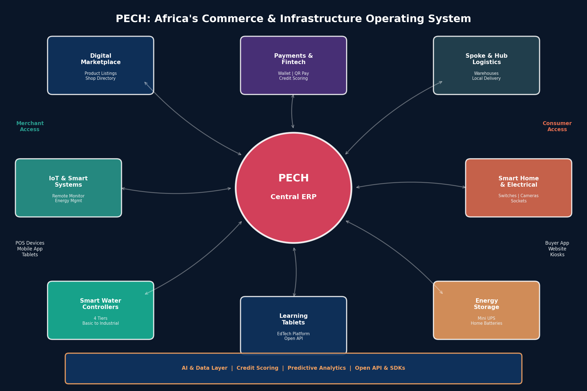
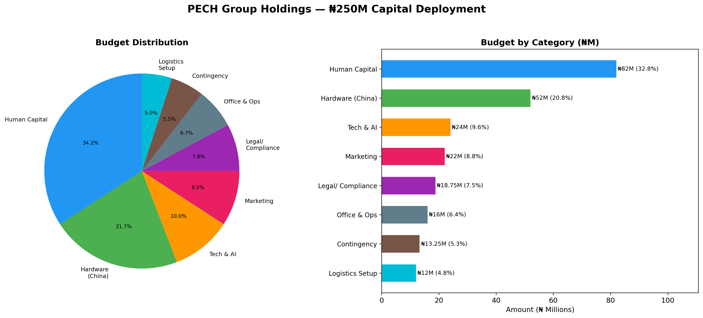
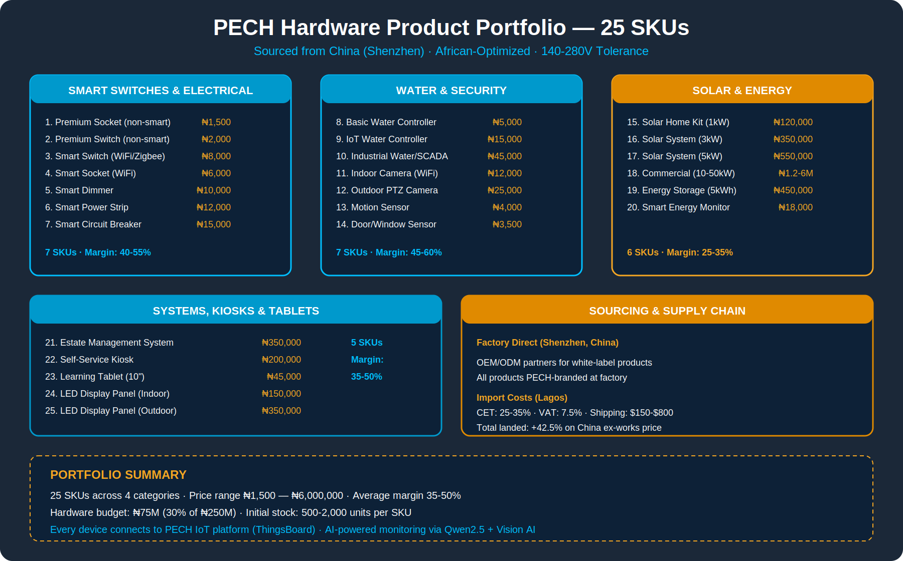
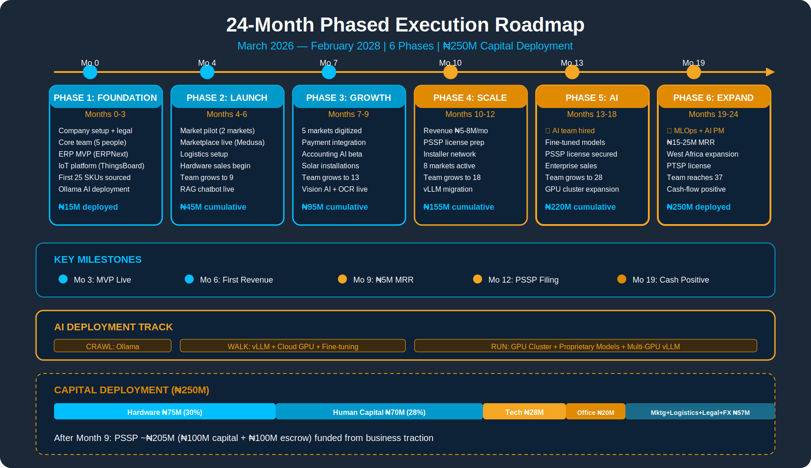
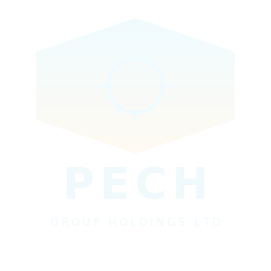

<div align="center">

<!-- ============== EXECUTIVE SUMMARY HEADER ============== -->
<div style="background:linear-gradient(135deg,#1B2838 0%,#0d1b2a 40%,#162435 100%);border-radius:16px;padding:0;overflow:hidden;border:2px solid #F5A623;box-shadow:0 8px 32px rgba(245,166,35,0.15),0 4px 16px rgba(0,191,255,0.1),0 0 60px rgba(245,166,35,0.05);">

<div style="height:5px;background:linear-gradient(90deg,#F5A623,#E08A00 20%,#00BFFF 40%,#0099CC 60%,#F5A623 80%,#E08A00);"></div>
<div style="height:2px;background:linear-gradient(90deg,#00BFFF,#F5A623 50%,#00BFFF);"></div>

<div style="padding:32px 44px 24px;">

<div style="display:inline-block;background:linear-gradient(135deg,#F5A623,#E08A00);border-radius:12px;padding:12px 16px;margin-bottom:10px;box-shadow:0 4px 20px rgba(245,166,35,0.3);">
<span style="font-size:2em;">📋</span>
</div>


<h1 style="margin:8px 0 0;font-size:2.1em;background:linear-gradient(90deg,#F5A623,#00BFFF);-webkit-background-clip:text;-webkit-text-fill-color:transparent;background-clip:text;">PECH Group Holdings Ltd</h1>

<h2 style="margin:6px 0 16px;font-size:1.2em;color:#F5A623;font-weight:600;letter-spacing:0.5px;">Executive Summary — ₦250M Capital Deployment Plan</h2>

<p>


</p>

<p>


</p>

<div style="height:2px;background:linear-gradient(90deg,#F5A623,#00BFFF 50%,#F5A623);margin:14px -44px 0;"></div>
<div style="height:5px;background:linear-gradient(90deg,#00BFFF,#0099CC 20%,#F5A623 40%,#E08A00 60%,#00BFFF 80%,#0099CC);margin:0 -44px -24px;"></div>

</div>
</div>
<!-- ============== END HEADER ============== -->

</div>

---

## Our Mission

PECH is a **technology and infrastructure enabler for people**. We build the digital backbone that African businesses, homes, and communities run on.

Every product we ship represents **reliability, quality, and good price for your money**. We sell high-end products AND equally good affordable products, but **never bad products**. Quality is our brand promise.

All PECH products are **designed for Africa** — wide voltage tolerance, heat resistance, dust/water protection, offline capability — and **progressively integrated across our entire ecosystem**: IoT platform, ERP, Marketplace, Logistics, and Payments.

---

## The Company

**PECH Group Holdings Ltd** is building **Africa's first vertically-integrated Commerce & Infrastructure Operating System** — combining:

- **Embedded ERP** — Free business management for SMEs
- **IoT & Smart Systems** — Energy, security, estate management platform
- **Smart Water Controllers** — 4-tier water level controllers (Basic → Industrial/SCADA)
- **Smart Home & Electrical** — Switches, sockets, cameras (smart + non-smart)
- **Learning Tablets & EdTech** — Content deployment with open API for creators
- **Marketplace** — Digital twin of Nigeria's physical wholesale markets
- **Spoke-and-Hub Logistics** — Cainiao-inspired parcel management
- **Payments Infrastructure** — PSSP/PTSP payment processing
- **Energy Storage Systems** — Battery backups for IoT and homes
- **Advertising & LED Displays** — Digital signage infrastructure (Phase 2)
- **Self-Service Kiosks** — Multi-purpose payment/info terminals

---

## Secured Capital

**₦250,000,000** committed capital for the first 24 months. The investor will inject additional capital as the business gains traction.

---

<div align="center" style="margin:32px 0;">
<div style="height:1px;background:linear-gradient(90deg,transparent,#00BFFF 20%,#F5A623 50%,#00BFFF 80%,transparent);margin-bottom:6px;"></div>
<span style="font-family:'Montserrat','Segoe UI',Arial,sans-serif;font-size:10px;letter-spacing:8px;color:rgba(0,153,204,0.12);font-weight:800;text-transform:uppercase;">PECH GROUP HOLDINGS LTD</span>
<div style="height:1px;background:linear-gradient(90deg,transparent,#F5A623 20%,#00BFFF 50%,#F5A623 80%,transparent);margin-top:6px;"></div>
</div>

---



## Budget Allocation



| Category | Amount (₦) | % of Total |
|----------|-----------|-----------|
| **Hardware Procurement (25 SKUs from China)** | ₦75,000,000 | 30.0% |
| **Human Capital (Salaries & Contractors)** | ₦70,000,000 | 28.0% |
| **Technology Infrastructure & AI Tools** | ₦28,000,000 | 11.2% |
| **Office, Equipment & Operations** | ₦20,000,000 | 8.0% |
| **Contingency & Emergency Reserve** | ₦18,000,000 | 7.2% |
| **Marketing & Customer Acquisition** | ₦15,000,000 | 6.0% |
| **Logistics Platform (Stations Setup)** | ₦12,000,000 | 4.8% |
| **Licensing, Legal & Compliance** | ₦12,000,000 | 4.8% |
| **TOTAL** | **₦250,000,000** | **100%** |

```
  Hardware (25 SKUs)██████████████████████████████░░  30.0%  ₦75M
  Human Capital     ████████████████████████████░░░░  28.0%  ₦70M
  Tech & AI Tools   ███████████░░░░░░░░░░░░░░░░░░░░  11.2%  ₦28M
  Office & Ops      ████████░░░░░░░░░░░░░░░░░░░░░░░   8.0%  ₦20M
  Contingency       ███████░░░░░░░░░░░░░░░░░░░░░░░░   7.2%  ₦18M
  Marketing         ██████░░░░░░░░░░░░░░░░░░░░░░░░░   6.0%  ₦15M
  Logistics Setup   ████░░░░░░░░░░░░░░░░░░░░░░░░░░░   4.8%  ₦12M
  Legal/Compliance  ████░░░░░░░░░░░░░░░░░░░░░░░░░░░   4.8%  ₦12M
```

---



## Hardware Portfolio (25 SKUs)

| Category | Products | Price Range (₦) |
|----------|---------|----------------|
| **Commerce** | Smart POS, POS Tablet, Self-Service Kiosk, Barcode/Receipt Kit, Logistics Scanner | ₦40K–₦480K |
| **IoT & Energy** | Energy Controller, Smart Meter, Power Kit, Mini UPS, Home Battery | ₦18K–₦240K |
| **Water Controllers** | Tier 1 Basic, Tier 2 Mid-Range, Tier 3 Smart IoT, Tier 4 Industrial/SCADA | ₦22K–₦175K |
| **Smart Home** | Smart Switch, Smart Socket, Smart Camera, IP Camera, Premium Switch/Socket | ₦2.8K–₦58K |
| **Education & Display** | Learning Tablet, Indoor LED Panel, Outdoor LED Screen | ₦110K–₦250K |
| **Solar Products** | Solar Street Light, Solar Rechargeable Fan | ₦45K–₦200K |

---



## 24-Month Execution Roadmap

| Phase | Months | Focus | Budget (₦) |
|-------|--------|-------|-----------|
| **Phase 1: Foundation** | 0–3 | Core team (5 people), architecture, first hardware order, legal setup | ₦55,000,000 |
| **Phase 2: MVP & Pilot** | 4–6 | 50 merchants, 30 IoT devices, 2 logistics stations, smart home + solar products launch | ₦52,000,000 |
| **Phase 3: Market Entry** | 7–9 | 500 merchants, 3 markets, water controllers launch, marketing campaigns | ₦55,000,000 |
| **Phase 4: Revenue Scale** | 10–12 | 1,500 merchants, 300 devices, credit scoring prototype | ₦45,000,000 |
| **Phase 5: Ecosystem Maturity** | 13–18 | 3,000 merchants, 800 devices, API launch, LED displays, PSSP license application | ₦33,000,000 |
| **Phase 6: Growth & Expansion** | 19–24 | 5,000 merchants, 1,500 devices, West Africa expansion | ₦10,000,000 (revenue-funded) |

---

## Key Targets (24 Months)

| Metric | Month 6 | Month 12 | Month 18 | Month 24 |
|--------|---------|----------|----------|----------|
| Active Merchants (ERP) | 200 | 1,500 | 3,000 | 5,000 |
| IoT Devices Deployed | 50 | 300 | 800 | 1,500 |
| Markets Digitized | 1 | 3 | 5 | 8 |
| Monthly Revenue (₦) | 1.5M | 10.2M | 16.4M | 21.3M |
| Team Size | 9 | 18 | 25 | 30 |

**24-Month Cumulative Revenue:** ₦243.6M | **Break-even:** Month 16–18

---

<div align="center" style="margin:32px 0;">
<div style="height:1px;background:linear-gradient(90deg,transparent,#00BFFF 20%,#F5A623 50%,#00BFFF 80%,transparent);margin-bottom:6px;"></div>
<span style="font-family:'Montserrat','Segoe UI',Arial,sans-serif;font-size:10px;letter-spacing:8px;color:rgba(0,153,204,0.12);font-weight:800;text-transform:uppercase;">PECH GROUP HOLDINGS LTD</span>
<div style="height:1px;background:linear-gradient(90deg,transparent,#F5A623 20%,#00BFFF 50%,#F5A623 80%,transparent);margin-top:6px;"></div>
</div>

---

## Team Growth (Lean)

| Phase | People | Monthly Payroll (₦) | Key Hires |
|-------|--------|-------------------|-----------|
| Phase 1 (Mo 0–3) | 5 | ₦1,950,000 | CTO, 2 engineers, market ops |
| Phase 2 (Mo 4–6) | 9 | ₦3,060,000 | IoT engineer, DevOps, 2 agents |
| Phase 3 (Mo 7–9) | 13 | ₦4,310,000 | Payments PM, data analyst, 2 support |
| Phase 4 (Mo 10–12) | 18 | ₦5,320,000 | Logistics lead, 2 jr engineers, 2 agents |
| Phase 5 (Mo 13–18) | 22–25 | ₦6,690,000 | Data engineer, BD lead, field coordinator |
| Phase 6 (Mo 19–24) | 25–30 | ₦7,950,000 | PSSP compliance, 2 engineers, 2 agents |

---

## Payment & Wallet Licenses — Strategy

| License | Capital Required | Escrow Duration | Priority |
|---------|-----------------|----------------|----------|
| **PSSP** (Payments) | ~₦205M (₦100M capital + ₦100M escrow + fees) | **Life of license** (refundable on surrender) | **HIGH — GET ASAP** (Month 9+ from business traction) |
| **PTSP** (POS Terminals) | ~₦201M (₦100M capital + ₦100M escrow + fees) | **Life of license** (refundable on surrender) | When volume justifies |
| **MMO** (Wallets & Escrow) | ~₦4B (₦2B capital + ₦2B escrow + fees) | **Life of license** (refundable on surrender) | Future — when justified |

**Strategy:**
- **Now:** Partner with Paystack/Flutterwave for payments + partner PTSP + partner bank
- **PRIORITY:** Apply for PSSP after Month 9 when hardware sales and software revenue justify capital deployment
- **Future:** Own MMO license when transaction volume justifies the ₦4B capital requirement

> A PSSP license does NOT permit holding customer funds or issuing wallets — that requires an MMO license. PECH will use a white-label MMO partnership until own license is justified.

---

## Equity Structure

| Stakeholder | Allocation | Notes |
|------------|-----------|-------|
| Founder(s) | 55–60% | Controlling stake, hardware + vision |
| ESOP Pool | 10–12% | CTO, key hires (4-year vesting) |
| Seed/Angel Investors | 15–20% | This round |
| Strategic Reserve | 10–15% | Future rounds, partnerships |

---

## Competitive Edge

| Advantage | Description |
|-----------|-------------|
| **Ecosystem Lock-In** | Free ERP + hardware creates daily dependency |
| **Designed for Africa** | 140–280V tolerance, offline-first, heat/dust resistant |
| **Quality Promise** | Reliability + good price for money — no bad products |
| **Data Moat** | Transaction + energy + logistics data enables credit scoring |
| **Founder Advantage** | Direct China sourcing (Shenzhen) |
| **23 Hardware SKUs** | Widest African-optimized product range |

---

<div align="center" style="margin:32px 0;">
<div style="height:1px;background:linear-gradient(90deg,transparent,#00BFFF 20%,#F5A623 50%,#00BFFF 80%,transparent);margin-bottom:6px;"></div>
<span style="font-family:'Montserrat','Segoe UI',Arial,sans-serif;font-size:10px;letter-spacing:8px;color:rgba(0,153,204,0.12);font-weight:800;text-transform:uppercase;">PECH GROUP HOLDINGS LTD</span>
<div style="height:1px;background:linear-gradient(90deg,transparent,#F5A623 20%,#00BFFF 50%,#F5A623 80%,transparent);margin-top:6px;"></div>
</div>

---

**PECH Group Holdings Ltd**
Lagos, Nigeria
Pechenergysolutions@gmail.com | [pechgroupholdings.tech](https://pechgroupholdings.tech)

---

*This document is confidential and intended solely for the use of prospective investors and strategic partners of PECH Group Holdings Ltd. Unauthorized distribution is prohibited.*

<div style="height:5px;background:linear-gradient(90deg,#E08A00,#F5A623 25%,#0099CC 75%,#00BFFF);margin:20px -28px -24px -28px;"></div>
</div>


---

<div align="center" style="margin:48px 0 24px;">
<div style="height:3px;background:linear-gradient(90deg,#00BFFF,#0099CC 25%,#F5A623 50%,#E08A00 75%,#00BFFF);border-radius:2px;"></div>
<div style="padding:28px 0 8px;">

<div style="font-family:'Montserrat','Segoe UI',Arial,sans-serif;font-size:11px;letter-spacing:10px;color:rgba(0,153,204,0.13);font-weight:800;text-transform:uppercase;margin-bottom:4px;">PECH GROUP HOLDINGS LTD</div>
<div style="font-family:'Montserrat','Segoe UI',Arial,sans-serif;font-size:11px;letter-spacing:10px;color:rgba(0,153,204,0.13);font-weight:800;text-transform:uppercase;margin-bottom:4px;">PECH GROUP HOLDINGS LTD</div>
<div style="font-family:'Montserrat','Segoe UI',Arial,sans-serif;font-size:11px;letter-spacing:10px;color:rgba(0,153,204,0.13);font-weight:800;text-transform:uppercase;margin-bottom:4px;">PECH GROUP HOLDINGS LTD</div>
<div style="font-family:'Open Sans','Segoe UI',Arial,sans-serif;font-size:8px;letter-spacing:4px;color:rgba(245,166,35,0.18);font-weight:400;text-transform:uppercase;">Technology & Infrastructure Enablers for People</div>
<div style="margin-top:12px;">

</div>
</div>
<div style="height:3px;background:linear-gradient(90deg,#F5A623,#E08A00 25%,#00BFFF 50%,#0099CC 75%,#F5A623);border-radius:2px;"></div>
<div style="font-family:'Open Sans',Arial,sans-serif;font-size:7px;letter-spacing:3px;color:rgba(0,153,204,0.2);margin-top:8px;text-transform:uppercase;">Confidential — PECH Group Holdings Ltd — Lagos, Nigeria — pechgroupholdings.tech</div>
</div>
