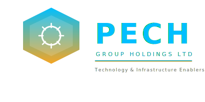

<div align="center">

<!-- ============== PECH BRANDED HEADER ============== -->
<div style="background:linear-gradient(135deg,#1B2838 0%,#0d1b2a 40%,#1B2838 100%);border-radius:16px;padding:0;overflow:hidden;border:2px solid #00BFFF;box-shadow:0 8px 32px rgba(0,191,255,0.15),0 4px 16px rgba(245,166,35,0.1);">

<!-- Top gradient bar -->
<div style="height:6px;background:linear-gradient(90deg,#00BFFF,#0099CC 20%,#F5A623 50%,#E08A00 80%,#00BFFF);"></div>

<div style="padding:32px 40px 24px;">

<!-- Inline SVG Logo -->


<h1 style="margin:0;font-size:2.2em;background:linear-gradient(90deg,#00BFFF,#F5A623);-webkit-background-clip:text;-webkit-text-fill-color:transparent;background-clip:text;">PECH Group Holdings Ltd</h1>

<p style="margin:8px 0 16px;font-size:1.15em;color:#00BFFF;font-weight:600;letter-spacing:1px;">TECHNOLOGY AND INFRASTRUCTURE ENABLERS FOR PEOPLE</p>

<!-- Badge row -->
<p>


</p>

<p>
<a href="https://pechgroupholdings.tech"></a>


</p>

<!-- Bottom gradient bar -->
<div style="height:4px;background:linear-gradient(90deg,#F5A623,#E08A00 20%,#00BFFF 50%,#0099CC 80%,#F5A623);margin:16px -40px -24px;"></div>

</div>
</div>
<!-- ============== END HEADER ============== -->

</div>

---

## Table of Contents

- [About](#about)
- [What We Do](#what-we-do)
- [Key Numbers](#key-numbers)
- [AI-Native Architecture](#ai-native-architecture)
- [Repository Overview](#repository-overview)
- [Contracts](#contracts-12-documents)
- [Team](#team--37-roles-across-5-departments) *(summary — full details in [Job Requirements Handbook](business_documents/PECH_JOB_REQUIREMENTS_HANDBOOK.md))*
- [Business Documents](#business-documents-26-forms)
- [AI Strategy Documentation](#ai-strategy-documentation)
- [Financial Proposals](#financial-proposals) *(summary — canonical figures in [Executive Summary](PECH_PROPOSAL_EXECUTIVE_SUMMARY.md))*
- [Brand & Design Assets](#brand--design-assets)
- [Automation Scripts](#automation-scripts)
- [Nigerian Legal Compliance](#nigerian-legal-compliance)
- [How to Use These Templates](#how-to-use-these-templates)
- [Contributing](#contributing)
- [Contact](#contact)

---

## About

PECH Group Holdings Ltd is a Nigerian technology company building Africa's first vertically-integrated **IoT and Smart Systems Platform**. We combine IoT hardware, solar energy, AI-powered services, digital commerce, fintech, and logistics into a single ecosystem — designed for African market realities: power instability, mobile-first users, price sensitivity, and offline-capable infrastructure.

**Our Mission:** To be technology and infrastructure enablers for people across Africa.

**Brand Philosophy:** Reliability, quality, and good price for your money — no bad products.

---

## What We Do

| Vertical | Description |
|----------|-------------|
| **IoT Devices & Smart Home** | Smart switches, sensors, controllers, home automation kits |
| **PECH Solar** | Solar panels, inverters, charge controllers, off-grid solutions |
| **AI Platform Services** | RAG chatbots, vision AI, OCR, text-to-speech, speech-to-text |
| **Digital Marketplace** | Multi-vendor commerce platform for African merchants |
| **Fintech / PSSP** | Payment processing, POS terminals, digital wallets |
| **Logistics & Delivery** | Hub-and-spoke fulfillment across Nigerian markets |
| **Commerce OS / ERP** | Merchant tools — inventory, invoicing, accounting, tax AI |
| **EdTech** | Smart classroom hardware and e-learning devices |
| **Water Tech** | Smart water monitoring and purification systems |
| **Enterprise Solutions** | Custom IoT and AI deployments for businesses |

**Hardware Portfolio:** 25 SKUs across 6 categories — purpose-built for African conditions (voltage tolerance, heat/dust resistance, offline capability).

---

## Key Numbers

> **Canonical source:** Financial figures are maintained in the [Executive Summary](PECH_PROPOSAL_EXECUTIVE_SUMMARY.md) and [Financial Proposal](PECH_GROUP_FINANCIAL_PROPOSAL_250M_NAIRA.md). The summary below is for quick reference.

| Metric | Value |
|--------|-------|
| Secured Capital | ₦250,000,000 (~$160K USD) |
| Deployment Period | 24 months (March 2026 — February 2028) |
| Team | 37 roles (24 FT + 5 contract + 8 intern) |
| Microservices | 78 across 12 domains |
| AI Models | 50+ open-source models, self-hosted |
| Hardware SKUs | 25 across 6 categories |
| Break-even Target | Month 16–18 |
| Month-24 Revenue Target | ₦21.3M/month |

---

## AI-Native Architecture

All AI is **self-hosted on RTX 4090 GPUs in Lagos** — open-source models only (Apache-2.0 / MIT licensed), fully rebrandable.

### Model Stack

| Category | Models | License |
|----------|--------|---------|
| **Primary LLM** | Qwen2.5 (0.5B–72B) | Apache-2.0 |
| **Secondary LLM** | Phi-4, Mistral 7B | MIT / Apache-2.0 |
| **Code** | Qwen2.5-Coder, DeepSeek-Coder-V2-Lite | Apache-2.0 / MIT |
| **Speech-to-Text** | Whisper, Faster-Whisper | MIT |
| **Text-to-Speech** | Piper TTS, Kokoro TTS | MIT / Apache-2.0 |
| **Vision** | Qwen2-VL, Qwen2.5-VL | Apache-2.0 |
| **OCR** | PaddleOCR, Tesseract | Apache-2.0 |
| **Embeddings** | MiniLM-L6, Nomic-Embed | MIT / Apache-2.0 |
| **Object Detection** | RT-DETR | Apache-2.0 |
| **ML / Forecasting** | XGBoost, LightGBM, Prophet | Apache-2.0 / MIT |

### Platform Stack

| Function | Tool | License |
|----------|------|---------|
| API Gateway | Apache APISIX | Apache-2.0 |
| Identity & Auth | Keycloak | Apache-2.0 |
| Commerce | Medusa | MIT |
| ERP | ERPNext | MIT |
| Fintech | Apache Fineract | Apache-2.0 |
| IoT | ThingsBoard CE | Apache-2.0 |
| Support | Chatwoot | MIT |
| Vector DB | Qdrant | Apache-2.0 |
| BI / Analytics | Apache Superset | Apache-2.0 |
| Workflow | Apache Airflow | Apache-2.0 |
| Graph DB | Apache AGE (PostgreSQL) | Apache-2.0 |
| Model Serving | Ollama → vLLM | MIT / Apache-2.0 |
| RAG Framework | LangChain + LangGraph | MIT |

### Deployment Phases

| Phase | Infrastructure | Description |
|-------|---------------|-------------|
| **Crawl** (Mo 1–6) | TRX50 + Ollama | Single workstation, Docker Compose, NATS |
| **Walk** (Mo 7–12) | Add 2nd GPU + vLLM | K3s orchestration, expanded capacity |
| **Run** (Mo 13–24) | Co-locate + scale | Full K8s, Kafka, multi-node cluster |

---

## Repository Overview

This repository contains the complete operational documentation for PECH Group Holdings — contracts, business forms, financial proposals, AI strategy, brand assets, and design system. All documents are Markdown-first for version control and easy export.

### Repository Structure

```
Pech-IOT-and-SMART-SYSTEMS-PLATFORM-FOR-AFRICA/
│
├── README.md                                    # This file
├── CLAUDE.md                                    # AI assistant project guidelines
├── CODEBASE_SUMMARY.md                          # Full codebase overview & conversation index
│
├── PECH_GROUP_FINANCIAL_PROPOSAL_250M_NAIRA.md  # Detailed 24-month capital deployment plan
├── PECH_INVESTOR_VERSION.md                     # Investor-focused business proposal
├── PECH_PROPOSAL_EXECUTIVE_SUMMARY.md           # Executive summary for investors
├── proposal_style.css                           # Styling for proposal documents
│
├── contracts/                    # 12 legal templates (Nigerian law compliant)
├── business_documents/           # 26 operational forms and templates
├── ai_strategy/                  # 6 AI strategy docs + 14 infographics
├── brand_templates/              # 13 brand collateral templates
├── design_assets/                # 14 logo variants + graphic elements
├── design_system/                # CSS design system + HTML component library
├── proposal_images/              # 26 charts and diagrams (SVG + PNG)
└── scripts/                      # Automation scripts for document export
```

**Total:** 130+ files across 9 directories.

---

## Contracts (12 documents)

Legal templates compliant with Nigerian labour law, NDPA 2023, and FCCPA 2019.

| # | Document | File | For |
|---|----------|------|-----|
| 1 | Full-Time Employment Contract | [`PECH_FULL_TIME_EMPLOYMENT_CONTRACT.md`](contracts/PECH_FULL_TIME_EMPLOYMENT_CONTRACT.md) | Permanent staff |
| 2 | Independent Contractor Agreement | [`PECH_CONTRACT_WORKER_AGREEMENT.md`](contracts/PECH_CONTRACT_WORKER_AGREEMENT.md) | Freelancers, consultants |
| 3 | Internship Agreement | [`PECH_INTERNSHIP_AGREEMENT.md`](contracts/PECH_INTERNSHIP_AGREEMENT.md) | Interns across all departments |
| 4 | Non-Disclosure Agreement | [`PECH_NON_DISCLOSURE_AGREEMENT.md`](contracts/PECH_NON_DISCLOSURE_AGREEMENT.md) | All staff, partners, visitors |
| 5 | Media & Public Communications Policy | [`PECH_MEDIA_AND_PUBLIC_COMMUNICATIONS_POLICY.md`](contracts/PECH_MEDIA_AND_PUBLIC_COMMUNICATIONS_POLICY.md) | All personnel |
| 6 | API Developer Agreement | [`PECH_API_DEVELOPER_AGREEMENT.md`](contracts/PECH_API_DEVELOPER_AGREEMENT.md) | Third-party developers |
| 7 | Certified Installer Agreement | [`PECH_INSTALLER_AGREEMENT.md`](contracts/PECH_INSTALLER_AGREEMENT.md) | IoT/solar technicians |
| 8 | Guarantor Form | [`PECH_GUARANTOR_FORM.md`](contracts/PECH_GUARANTOR_FORM.md) | Guarantors for all hires |
| 9 | Hackathon Rules & Guidelines | [`PECH_HACKATHON_RULES_AND_GUIDELINES.md`](contracts/PECH_HACKATHON_RULES_AND_GUIDELINES.md) | Hackathon participants |
| 10 | Commission Marketer Agreement | [`PECH_COMMISSION_MARKETER_AGREEMENT.md`](contracts/PECH_COMMISSION_MARKETER_AGREEMENT.md) | Commission-only sales agents |
| 11 | Office Marketer Agreement | [`PECH_OFFICE_MARKETER_AGREEMENT.md`](contracts/PECH_OFFICE_MARKETER_AGREEMENT.md) | Office-based marketing staff |
| 12 | Schedule B Templates | [`PECH_SCHEDULE_B_TEMPLATES.md`](contracts/PECH_SCHEDULE_B_TEMPLATES.md) | Contract attachment templates |

### Quick Reference: Which Contract to Use

| Scenario | Document |
|----------|----------|
| Hiring a permanent employee | Full-Time Employment Contract |
| Engaging a freelancer or consultant | Independent Contractor Agreement |
| Bringing on an intern | Internship Agreement |
| Hiring a commission-only sales agent | Commission Marketer Agreement |
| Hiring an office-based marketer (salary + commission) | Office Marketer Agreement |
| Engaging an API/platform developer | API Developer Agreement |
| Certifying an installer/technician | Certified Installer Agreement |
| Anyone who needs to sign an NDA | Non-Disclosure Agreement |
| All personnel (media conduct) | Media & Public Communications Policy |
| Running a hackathon | Hackathon Rules & Guidelines |
| Requiring a guarantor | Guarantor Form |

### Agreement Type Comparison

| Feature | Full-Time | Contractor | Commission Marketer | Office Marketer | Intern |
|---------|-----------|------------|---------------------|-----------------|--------|
| **Status** | Employee | Independent | Independent | Employee | Intern |
| **Base Salary** | Yes | Retainer/Project | No (commission only) | Yes + Commission | Stipend |
| **Pension** | Yes (10%+8%) | No | No | Yes (10%+8%) | No |
| **NHIA** | Yes | No | No | Yes | No |
| **Group Life** | Yes (3x salary) | No | No | Yes (3x salary) | No |
| **Leave** | 20 days | Per contract | N/A | 20 days | As agreed |
| **Non-Compete** | 24 months | 12 months | 12 months | 12 months | 6 months |
| **Tax** | PAYE | Own responsibility | Own + 5% WHT | PAYE | N/A |

---

## Team — 37 Roles Across 5 Departments

Scaling from 5 to 37 over 24 months across 6 hiring phases. Full role descriptions, qualifications, and compensation details are in the [Job Requirements Handbook](business_documents/PECH_JOB_REQUIREMENTS_HANDBOOK.md).

| Department | Roles | Includes |
|------------|-------|----------|
| **Engineering** | 14 | CTO, Full-Stack (Web + Mobile), Frontend, Backend, IoT/Embedded, DevOps, AI/ML, MLOps, Data Engineer, QA, API/Platform |
| **Design** | 1 | UI/UX Designer |
| **Product & Business** | 7 | Payments PM, Data Analyst, BD Lead, PSSP Compliance, AI PM, DevRel, Technical Writer |
| **Operations** | 7 | Market Ops, Logistics, Field Coordinator, Support, Field Agents, Installer Network, Fintech Ops |
| **Internship Programme** | 8 | Frontend, Backend, IoT, DevOps, UI/UX, Data/Analytics, Business Ops, AI/ML |

**Hiring Timeline:** Phase 1 (Mo 1–4): 5 people → Phase 2 (Mo 5–8): 9 → Phase 3 (Mo 9–12): 13 → Phase 4 (Mo 13–16): 18 → Phase 5 (Mo 17–20): 22–25 → Phase 6 (Mo 21–24): 25–30

---

## Business Documents (26 forms)

Operational forms organized by function. See [`business_documents/README.md`](business_documents/README.md) for the full guide.

| Category | Documents |
|----------|-----------|
| **HR & Operations** | Candidate Application Form, Interview Checklist, Job Requirements Handbook, Staff ID Card Request, Leave Request, Asset Register, Incident Report, Visitor Log |
| **Sales & Orders** | Quotation, Proforma Invoice, Sales Invoice, Purchase Order, Work Order, Job Completion Report |
| **Inventory & Logistics** | Stock Requisition, Delivery Note, Goods Received Note, Waybill, Installation Completion Certificate |
| **Finance & Payments** | Payment Receipt, Payment Voucher, Petty Cash Voucher, Expense Report, Credit Note, Debit Note |

---

## AI Strategy Documentation

Comprehensive technical strategy for the PECH AI ecosystem. See [`ai_strategy/README.md`](ai_strategy/README.md) for the full index.

| Document | Description |
|----------|-------------|
| [`PECH_ECOSYSTEM_COMPREHENSIVE_GUIDE.md`](ai_strategy/PECH_ECOSYSTEM_COMPREHENSIVE_GUIDE.md) | Master reference — all 10 verticals, models, platforms, hardware, team, budget |
| [`PECH_AI_MODEL_CATALOG.md`](ai_strategy/PECH_AI_MODEL_CATALOG.md) | 50+ models across 15 categories with license verification |
| [`PECH_OPEN_SOURCE_PLATFORM_STACK.md`](ai_strategy/PECH_OPEN_SOURCE_PLATFORM_STACK.md) | 25+ open-source tools with links, licenses, integration maps |
| [`PECH_AI_HARDWARE_AND_SETUP_GUIDE.md`](ai_strategy/PECH_AI_HARDWARE_AND_SETUP_GUIDE.md) | Hardware BOM, China sourcing, Nigeria import duties, server setup |
| [`PECH_AI_ARCHITECTURE_GUIDE.md`](ai_strategy/PECH_AI_ARCHITECTURE_GUIDE.md) | 78-microservice architecture, RAG pipeline, API gateway, deployment |

**Infographics** (SVG + PNG in `ai_strategy/images/`): Ecosystem Architecture, Model Stack, Data Pipeline, Infrastructure Diagram, Team Structure, Roadmap Phases, Hub-and-Spoke Logistics.

---

## Financial Proposals

| Document | Format | Description |
|----------|--------|-------------|
| [Executive Summary](PECH_PROPOSAL_EXECUTIVE_SUMMARY.md) | MD / DOCX / PDF | One-pager for investors **(canonical source for key metrics)** |
| [Full Financial Proposal](PECH_GROUP_FINANCIAL_PROPOSAL_250M_NAIRA.md) | MD / DOCX / PDF | Detailed 24-month ₦250M capital deployment plan **(canonical source for budget breakdown)** |
| [Investor Version](PECH_INVESTOR_VERSION.md) | MD / DOCX / PDF | Full investor-focused business proposal |

For budget allocation, 24-month targets, and financial projections, refer to the canonical documents linked above. Key highlights: ₦250M total capital, 24-month deployment, break-even at Month 16–18, ₦21.3M/month revenue target by Month 24.

---

## Brand & Design Assets

### Brand Templates (13 templates)

Professional collateral in [`brand_templates/`](brand_templates/). See [`brand_templates/README.md`](brand_templates/README.md) for the complete guide.

Brand Guidelines, Business Card, Letterhead, Branded Invoice, Email Signature, Certificate, Presentation, Newsletter, Report Cover, Social Media Templates, Merchandise Guidelines, Signage Template.

### Design Assets

| Asset | Location | Formats |
|-------|----------|---------|
| Logo Variants (Primary, Horizontal, White, Icon-Only) | `design_assets/logos/` | SVG + PNG |
| Favicon, Social Media Profile | `design_assets/logos/` | SVG + PNG |
| Color Palette, Gradient Bar, Pattern BG, Watermark | `design_assets/graphics/` | SVG |

### Design System

| File | Description |
|------|-------------|
| [`pech_design_system.css`](design_system/pech_design_system.css) | Complete CSS design system with brand variables |
| [`pech_components.html`](design_system/pech_components.html) | HTML component library and showcase |

### Brand Colors

| Color | Hex | Usage |
|-------|-----|-------|
| PECH Sky Blue | `#00BFFF` | Primary brand color, headings |
| PECH Orange/Amber | `#F5A623` | Secondary, accents, highlights |
| Dark Blue | `#0099CC` | Darker shade for depth |
| Dark Orange | `#E08A00` | Darker accent shade |
| Dark Background | `#1B2838` | Dark navy for charts/backgrounds |
| White | `#FFFFFF` | Text on dark backgrounds |

---

## Automation Scripts

| Script | Description |
|--------|-------------|
| [`scripts/export_hr_docs.sh`](scripts/export_hr_docs.sh) | Export HR documents to PDF/DOCX via Pandoc |
| [`scripts/generate_application_form.py`](scripts/generate_application_form.py) | Generate application forms programmatically |

---

## Nigerian Legal Compliance

All documents comply with the following Nigerian legislation:

| Law | Key Provisions |
|-----|---------------|
| **Labour Act (Cap L1, 2004)** | Written contracts for engagements >3 months; minimum notice and leave |
| **Pension Reform Act 2014** | Employer 10% + Employee 8% pension contributions |
| **NHIA Act 2022** | Mandatory health insurance for organizations with 5+ employees |
| **Group Life Insurance** | Mandatory 3x annual salary group life cover |
| **Employee Compensation Act 2010** | 1% of payroll to NSITF |
| **NDPA 2023** | Nigeria Data Protection Act — consent for personal data processing |
| **FIRS (Withholding Tax)** | 5% WHT on contractor payments; 10% on professional services |
| **FCCPA 2019** | Non-compete must be reasonable (max 2 years) |
| **Consumer Protection Act** | Compliance for customer-facing activities |
| **Copyright Act** | IP assignment clauses required — copyright defaults to employee |

> **Disclaimer:** These templates are provided for guidance only and do not constitute legal advice. Always consult a qualified Nigerian legal practitioner before executing any agreement.

---

## How to Use These Templates

### 1. Fill in the Blanks

All templates use `_______________` as placeholders. Fill in names, dates, addresses, contract reference numbers, and role-specific details.

### 2. Reference Number Format

| Prefix | Document |
|--------|----------|
| `PECH/EMP/___/______` | Full-Time Employment |
| `PECH/CON/___/______` | Independent Contractor |
| `PECH/INT/___/______` | Internship |
| `PECH/NDA/___/______` | Non-Disclosure Agreement |
| `PECH/API/___/______` | API Developer |
| `PECH/INS/___/______` | Certified Installer |
| `PECH/CMA/___/______` | Commission Marketer |
| `PECH/OMA/___/______` | Office Marketer |
| `PECH/GUA/___/______` | Guarantor Form |
| `PECH/HCK/___/______` | Hackathon |

### 3. Export to Word/PDF

```bash
# Using Pandoc
pandoc contracts/PECH_FULL_TIME_EMPLOYMENT_CONTRACT.md -o contract.docx

# Batch export HR documents
bash scripts/export_hr_docs.sh
```

Or use VS Code Markdown-to-PDF extensions, Google Docs, or any Markdown renderer.

---

## Contributing

1. Fork this repository
2. Create a feature branch (`git checkout -b feature/new-document`)
3. Make your changes
4. Submit a pull request with a description of what was changed and why

All contract modifications should be reviewed by a legal professional before merging.

---

## Contact

**PECH Group Holdings Ltd**
Lagos, Nigeria
Website: [pechgroupholdings.tech](https://pechgroupholdings.tech)

---

*This repository and its contents are confidential and proprietary to PECH Group Holdings Ltd. Unauthorized distribution is prohibited.*
